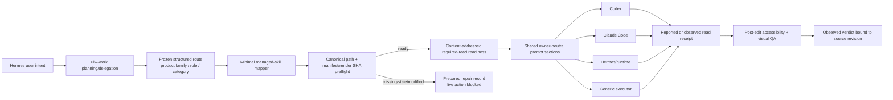

# OMH Visual-Engineering Design Skill Harness

## Executive decision

OMH already has more than model routing. It ships managed `design-orchestration`, `design-quality-gate`, `frontend`, `accessibility-audit`, and `visual-qa` workflows with generated skills, routing, wrapper actions, and evidence boundaries. Separately, `visual-engineering` is a coding model category and executor-local design skills are only discovered as advisory options. [S11] [S12] [S14] [S15] [S21]

The missing capability is deterministic carriage and gating: when `ulw-work` delegates a unit whose frozen role/category identifies visual work, the selected owner is not currently required to read the relevant OMH-managed design skills before normal execution. Existing executor-local `skill_sequence` wording is explicitly droppable and cannot serve as enforcement. [S25] [S26]

**Recommendation:** extend the existing design/frontend lanes; add no public skill or command. Derive a minimal managed-skill read set from already-declared structured route/product-family metadata, resolve only canonical OMH-managed files, pin rendered digests in a separate readiness artifact, fail closed before live action when content is missing/stale/modified, render the requirement through every owner-neutral prompt path, and preserve observed-versus-reported evidence. Adapt useful upstream techniques into existing generated guidance/references without vendoring the upstream corpus or installer. [S1] [S5] [S7] [S8] [S16] [S24] [S25] [S26]

## 1. Research protocol

- Upstream was pinned to `a38d04c3d5c298c851dbe5e6ee1965ee3de42cb5`; mutable README counts were not used as contracts. [S4] [S6]
- Repository claims in this public dossier are grounded in the named source, generated projections, and contract-test definitions. [S11] [S12] [S13] [S19] [S21] [S22]
- Upstream behavior is characterized from the pinned source and data contracts rather than presented as committed runtime evidence. [S7] [S8] [S10]
- Architecture findings were cross-checked across catalog, executor-neutrality, provenance, QA-contract, and adversarial analyses before inclusion.
- Prepared requirements, executor reports, tool observation, guidance application, and visual PASS remain distinct evidence states.

This planning PR does not publish raw session transcripts or temporary command logs. Its automated browser check established document structure, viewport containment, and error-free rendering only; it is not a human visual-quality approval or product-runtime claim.

## 2. What OMH already has

| Surface | Existing behavior | Boundary |
| --- | --- | --- |
| `design-orchestration` | Captures direction and composes specialist design lanes | Prepared direction; no executor or visual verdict |
| `design-quality-gate` | Premium multi-format references, hierarchy, typography, layout, CJK/accessibility checks | Primarily managed guidance |
| `frontend` | `DESIGN.md`, tokens, responsive/state matrix, motion, accessibility, CJK, performance, implementation handoff | Rich guidance; no deterministic stack corpus |
| `accessibility-audit` | WCAG, keyboard/focus, semantics, screen-reader, target-size, contrast, reflow | Audit guidance with explicit evidence boundary |
| `visual-qa` | Viewport/state/capture/review workflow and PASS/HOLD/BLOCK semantics | Observed captures are required for verdict |
| `visual-engineering` | Model/category route for `design_visual` coding units | Not a managed skill |
| executor skill discovery | Locates owner-local skills and suggests a sequence | Presence on disk is not load/read/run evidence |

The source-to-generated chain is catalog definitions and harnesses → catalog exposure → packaging/render → checked-in managed skills/docs → setup/update installation. The repository defines byte-current checks for those projections. [S11] [S12] [S13] [S16] [S17] [S18] [S19] [S21]

## 3. What the upstream skill contributes

At the pinned revision, UI/UX Pro Max provides:

- a standard-library local BM25/domain/stack search engine with structured JSON and no runtime network dependency; [S7]
- structured stack rows with do/don't, good/bad code, severity, documentation URL, applies-to, status, and freshness; [S7] [S8]
- a design-system generator with product/style/color/typography/UX/chart/icon/motion aggregation and variance/motion/density controls; [S7]
- master design-system plus page-specific override persistence; [S7]
- a closed reasoning grammar that admits allowlisted structured values instead of executable free text; [S7]
- deterministic data validation and source-to-bundled asset parity contracts; [S10]
- independent skill entrypoints for brand, design-system, design, slides, styling, and the primary searchable orchestrator. [S6]

The implementation plan converts those source-derived techniques into explicit positive and failure-path QA rather than treating temporary research-session output as shipped evidence.

## 4. Comparative matrix

| Dimension | OMH today | Upstream | Decision |
| --- | --- | --- | --- |
| User entry | Natural Hermes intent and managed workflow routing | Executor-local skill activation | Keep OMH entry; no new command |
| Design ownership | Five established complementary workflows | One searchable orchestrator plus siblings | Extend OMH owners; do not duplicate |
| Guidance retrieval | Catalog prose and project `DESIGN.md` | Local searchable structured corpus | Adapt search-before-build and structured guidance |
| Stack guidance | Framework accepted but no deterministic table | 22 stack datasets and structured results | Independently author compact/reference guidance; no wholesale copy |
| Design state | Prepared contracts/directions | Master plus page overrides | Adapt as project-level `DESIGN.md` plus page/route override convention |
| Design dials | Direction fields and anti-patterns | Variance, motion, density controls | Adapt into structured prepared guidance |
| Executor neutrality | Codex, Claude Code, Hermes/runtime, generic handoffs | Platform-specific generated installs | Keep one owner-neutral OMH contract |
| Integrity | Managed generated bytes and manifests | Source/assets sync and validators | Require canonical path + rendered SHA + no local modification |
| Evidence | Strong prepared/observed separation and visual-QA ladder | Search/design output, not OMH lifecycle evidence | Preserve OMH evidence model |
| Update/network | Deterministic local setup/update | CLI can fetch GitHub/npm and update itself | Reject upstream runtime/auto-update |
| Provenance | No general third-party ledger today | MIT root; lineage lacks per-record rights | Adapt mechanics; avoid corpus vendoring |

## 5. Adopt, adapt, reject

### ADOPT

1. **Search-before-build discipline:** a visual unit must consult relevant guidance before planning/editing, not after implementation. [S7] [S11]
2. **Structured, local, deterministic retrieval:** use closed fields and bounded local data rather than free-form remote lookups. [S7]
3. **Master plus scoped overrides:** treat project design direction as the master and route/page decisions as explicit overrides. [S7]
4. **Design dials and anti-patterns:** preserve variance, motion, density, and forbidden-pattern decisions as structured prepared context. [S7] [S11]
5. **Stack/accessibility freshness metadata:** guidance should name scope, severity, source, and verification date where factual. [S8]

### ADAPT

1. Put independently authored detailed guidance in progressive-disclosure managed references wired through OMH generation, not every always-loaded skill body. [S13] [S16]
2. Extend existing `frontend`/design guidance rather than add `visual-engineering` as a managed skill. [S11] [S15] [S21]
3. Promote existing product-family recommended skills into a content-pinned `required_skill_reads/v1` ordinary-handoff sub-contract. [S26]
4. For fanout, derive the requirement at dispatch from the frozen role/category and store a separate readiness artifact; do not mutate `fanout_contract/v2`. [S1] [S25]
5. Classify receipts as tool-observed only with matching file-read telemetry; otherwise retain executor-reported status. [S25] [S26]

### REJECT

1. A new public design/UI-UX skill, command, awareness lane, role, or implicit executor.
2. Raw `design`/`publish` substring routing.
3. Overloading droppable executor-local `skill_sequence`.
4. Direct upstream installer, update, GitHub/npm, font, or persist-mode behavior in OMH core.
5. Wholesale CSV/gallery/asset vendoring without a per-record rights review.
6. Concatenating all five skill bodies into every visual prompt.
7. Calling a prepared requirement or self-reported receipt observed compliance.
8. Calling skill reads visual QA.

## 6. Proposed target harness architecture

This architecture is the research recommendation, not current implementation. The later implementation must prove readiness storage, path/digest/TOCTOU enforcement, exact subtype mapping, owner-carriage behavior, and capture/source revision binding before any availability claim.

### Proposed minimal skill mapping

Use existing structured ownership, never task-prose inference:

| Frozen context | Required managed reads |
| --- | --- |
| broad visual direction | `design-orchestration` plus the selected specialist owner |
| web/mobile/desktop UI implementation | `frontend`; add `accessibility-audit` when acceptance includes accessibility |
| premium visual publishing | `design-quality-gate`; add the chosen production owner |
| rendered acceptance/review phase | `visual-qa` |
| non-visual API/backend/docs/copy | none |

The implementation should record the policy revision and exact IDs/digests. It should preserve the same semantic requirement through owner retargeting while using separate fanout and ordinary-handoff transport artifacts. This behavior is planned, not implemented or observed in this research run.

## 7. Security and evidence boundaries

- Only catalog-derived OMH-managed regular files inside the managed skill root qualify.
- Manifest membership, rendered digest, package freshness, no symlink, no local modification, and no time-of-check/time-of-use mismatch are mandatory.
- Missing/stale/modified/unsupported states receive explicit setup/update/doctor repair; live action stays blocked.
- Executor-local third-party skill files remain advisory and sanitized; they never become hard-gate inputs.
- A read receipt does not establish understanding, application, accessibility, visual quality, tests, review, CI, or merge readiness.
- Prompt-only owners cannot provide observed read telemetry; their receipt remains executor-reported.
- The policy is designed to be owner-neutral, but cross-owner carriage is an implementation target; only adapters with matching telemetry can later classify a read as observed.
- Visual PASS requires fresh browser/capture evidence bound to the edited source revision.

## 8. Verification contract

1. Positive structured activation: visual product families, `design_visual`, and `visual-engineering`.
2. Negative controls: API/backend, ordinary docs/copy, “design document,” architecture design, package/release publishing, and incidental category text.
3. Required-read mapping: deterministic minimal set, policy revision, canonical paths, digests, owner-retarget preservation.
4. Integrity: missing, stale, modified, symlinked, out-of-root, wrong digest, concurrent update, and unsupported owner all fail closed.
5. Fanout: `fanout_contract/v2` bytes remain unchanged; dispatch derives and records separate readiness.
6. Ordinary owners: executor/runtime/prompt handoffs carry semantically equivalent requirements.
7. Receipts: missing, malformed, partial, matching reported, and matching observed cases preserve evidence classification.
8. Generated content: managed skills/references/docs/profile installation and context-cost budgets remain current.
9. Real surface: post-edit browser QA at fixed viewports with source-revision-bound captures and blocking results.

## 9. Risks and mitigations

| Risk | Mitigation |
| --- | --- |
| false “required” assurance | hard action gate plus mandatory receipt; no observed claim without telemetry |
| frozen bridge violation | derive outside `fanout_contract/v2` |
| supply-chain injection | only canonical OMH-managed rendered bytes qualify |
| missing full-profile skills | prepared repair artifact; live action blocked until setup/update/doctor passes |
| prompt bloat | minimal set and progressive references; `skill-context-cost` gate |
| routing theft | structured routes only; positive and negative corpora if routing policy changes |
| third-party rights | technique adaptation and independent authorship; no corpus vendoring |
| fake visual QA | source-revision-bound browser evidence remains a separate final gate |

## 10. Sources

- [S1] `AGENTS.md` — product and frozen fanout boundaries.
- [S4] Upstream pinned commit: https://github.com/nextlevelbuilder/ui-ux-pro-max-skill/commit/a38d04c3d5c298c851dbe5e6ee1965ee3de42cb5
- [S5] Upstream MIT license: https://github.com/nextlevelbuilder/ui-ux-pro-max-skill/blob/a38d04c3d5c298c851dbe5e6ee1965ee3de42cb5/LICENSE
- [S6] Upstream README: https://github.com/nextlevelbuilder/ui-ux-pro-max-skill/blob/a38d04c3d5c298c851dbe5e6ee1965ee3de42cb5/README.md
- [S7] Upstream search/design-system code: https://github.com/nextlevelbuilder/ui-ux-pro-max-skill/tree/a38d04c3d5c298c851dbe5e6ee1965ee3de42cb5/src/ui-ux-pro-max/scripts
- [S8] Upstream UX guidance data: https://github.com/nextlevelbuilder/ui-ux-pro-max-skill/blob/a38d04c3d5c298c851dbe5e6ee1965ee3de42cb5/src/ui-ux-pro-max/data/ux-guidelines.csv
- [S10] Upstream release and catalog-refresh workflows: https://github.com/nextlevelbuilder/ui-ux-pro-max-skill/tree/a38d04c3d5c298c851dbe5e6ee1965ee3de42cb5/.github/workflows
- [S11] `src/skills/catalog_definitions.py`.
- [S12] `src/skills/catalog_harnesses.py`.
- [S13] `src/skills/catalog.py`, `src/skills/packaging.py`, `src/skills/render.py`.
- [S14] `src/routing/chat.py`, `src/routing/recommend.py`.
- [S15] `src/coding/model_routing.py`, `src/coding/executor_skill_discovery.py`.
- [S16] `docs/ADDING-A-SKILL.md`.
- [S17] `src/install/installer.py`, `src/commands/setup.py`.
- [S18] `src/plugin_bundle/omh/awareness.py`.
- [S19] `tests/test_router_content.py`, `tests/test_model_routing.py`, `tests/test_skill_governance.py`, and `tests/test_installer_skill_profile.py`.
- [S21] checked-in generated `skills/omh-{design-orchestration,design-quality-gate,frontend,accessibility-audit,visual-qa}/SKILL.md`.
- [S22] `src/workflows/design_orchestration.py`, `design_directions.py`, `web_visual_qa.py`, and `web_visual_qa_contracts.py`.
- [S24] pinned upstream provenance/font/icon manifests.
- [S25] `src/coding/fanout.py`, `executor_skill_discovery.py`, `fanout_dispatch.py`, `fanout_unit_results.py`.
- [S26] `src/coding/coding_delegation.py`, `src/workflows/role_context_packs.py`, and `src/coding/executor_guidance_compatibility.py`.
