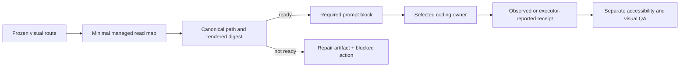

# Synthesis — OMH-native design skill harness

## Verdict

OMH does not merely route a visual model: it already owns a substantive set of managed design workflows. The product gap is that structured `ulw-work`/`visual-engineering` coding handoffs do not carry a hard, content-pinned obligation to read those managed skills before normal execution. [S11] [S12] [S15] [S21] [S25] [S26]

This is a source-backed planning recommendation. It does not claim product execution, human visual approval, or committed runtime replay evidence.

Implement **no new user-facing skill or command**. Add a minimal required-read policy over the existing managed set, use declared route/product-family metadata only, preserve frozen `fanout_contract/v2`, and keep executor-reported/observed/visual evidence separate. [S1] [S25] [S26]

## Adopt

- Local deterministic search-before-build workflow and structured retrieval contracts. [S7]
- Master design direction plus scoped route/page overrides. [S7]
- Structured variance/motion/density/anti-pattern decisions. [S7] [S11]
- Stack/accessibility rows with scope, source, status, severity, and freshness. [S8]
- Canonical managed path and digest checks before a required read. [S13] [S17] [S25]

## Adapt

- Independently author compact progressive-disclosure guidance for existing design/frontend skills; do not copy the upstream corpus. [S13] [S16] [S24]
- Attach `required_skill_reads/v1` to ordinary executor/runtime/prompt handoffs using existing recommended-skill/product-family data. [S26]
- Derive fanout read requirements from the frozen visual route at dispatch and store a separate content-addressed readiness artifact. [S1] [S25]
- Reuse existing capability-report semantics for receipts, preserving executor-reported versus observed status. [S25] [S26]
- Keep accessibility and source-revision-bound visual QA as later observed gates. [S12] [S22]

## Reject

- New umbrella design skill, command, role, awareness lane, or implicit executor.
- Mutation of `fanout_contract/v2`.
- Raw natural-language `design`/`publish` activation.
- Advisory executor-local discovery as enforcement.
- Direct upstream CLI/install/update/persist/font behavior.
- Wholesale CSV/gallery/assets vendoring without rights review.
- All-five-skill prompt injection.
- Read receipt as proof of guidance application or visual PASS.

## Proposed evidence-backed target

The diagram is a decision-complete architecture recommendation, not a claim that the readiness, prompt-carriage, acknowledgement, or source-revision binding exists today.

## Current decisions

- **New skill or existing?** Existing.
- **Free-text or structured activation?** Structured only.
- **Fanout contract change?** No.
- **Missing skill behavior?** Repair artifact may prepare; live action fails closed.
- **Executor neutrality?** One semantic policy, existing shared handoff rendering, adapter-specific evidence classification.
- **Upstream corpus?** Do not vendor; adapt techniques and independently author guidance.
- **Visual proof?** Separate source-revision-bound browser/capture gate.

## Deferred implementation investigations

The implementation plan must locate or add the narrowest standalone readiness artifact, threat-test path/digest/TOCTOU cases, define exact minimal mappings, preserve setup/update/core/full behavior, and add source-revision binding to visual captures before claiming freshness.

Cross-owner carriage remains planned. Prompt-only owners can return executor-reported acknowledgements; observed read evidence is available only where matching local telemetry exists.

## Source index

[S1] repository `AGENTS.md`; [S5] pinned upstream MIT license; [S7] pinned upstream search/design-system code; [S8] pinned UX data; [S11-S19] OMH catalog, harness, routing, install, awareness, and tests; [S21-S22] managed projections and typed design/QA code; [S24] pinned provenance/font/icon manifests; [S25-S26] fanout and ordinary-handoff code.
