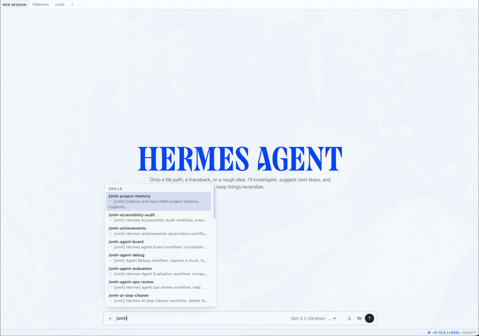
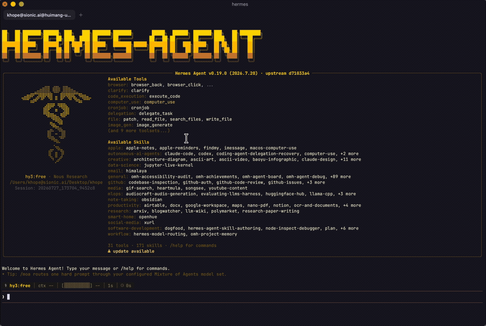
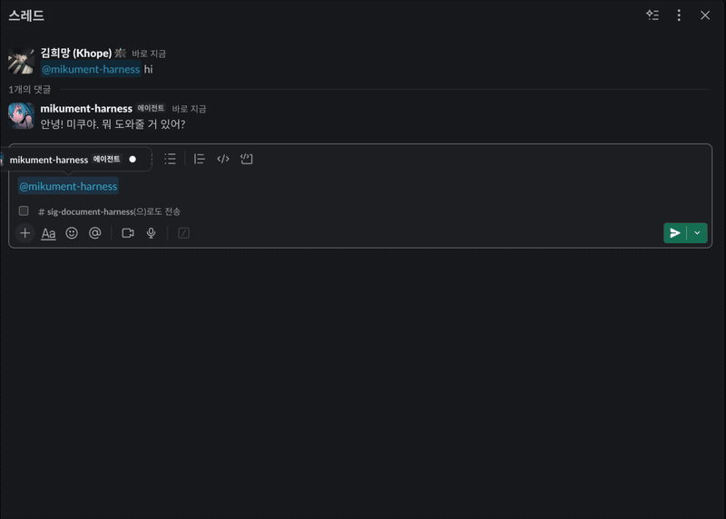
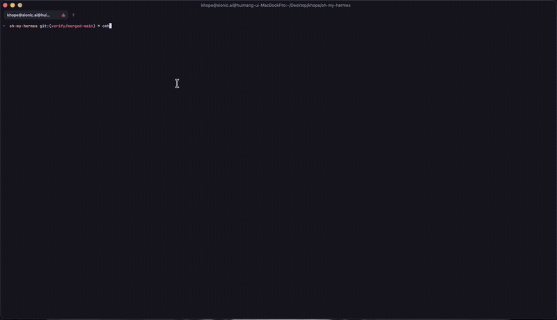
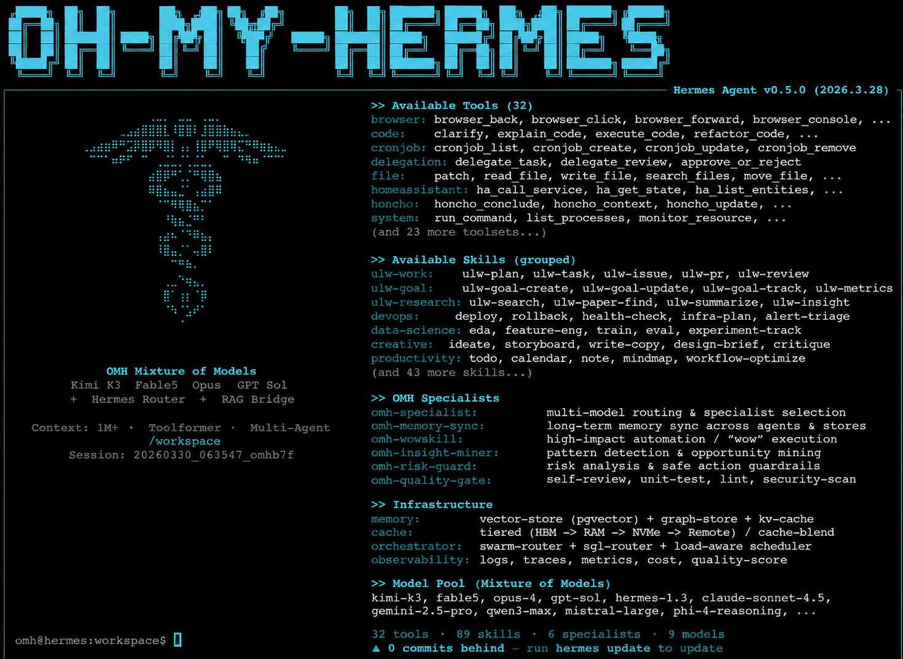

<p align="center">
  
</p>

<table align="center">
  <tr>
    <td width="50%" align="center">
      <br>
      <sub><b>Hermes 데스크톱, oh-my-hermes와 함께.</b><br>워크플로를 고르면, 만들기 전에 먼저 확인합니다.</sub>
    </td>
    <td width="50%" align="center">
      <br>
      <sub><b>Hermes CLI, oh-my-hermes와 함께.</b><br>쓰던 터미널에서 같은 워크플로를.</sub>
    </td>
  </tr>
  <tr>
    <td width="50%" align="center">
      <br>
      <sub><b>Hermes 메신저 앱, oh-my-hermes와 함께.</b><br>스레드에서 요청하면 같은 스레드로 답합니다.</sub>
    </td>
    <td width="50%" align="center">
      <br>
      <sub><b><code>omh setup</code>, 명령 하나로.</b><br>워크플로를 설치하고 Hermes에 연결합니다.</sub>
    </td>
  </tr>
</table>

# oh-my-hermes

<p align="center">
  <a href="README.md">English</a> |
  <a href="README.ko.md">한국어</a> |
  <a href="README.ja.md">日本語</a> |
  <a href="README.zh.md">中文</a>
</p>

<p align="center">
  <a href="https://github.com/rlaope/oh-my-hermes"></a>
  <a href="https://github.com/NousResearch/hermes-agent"></a>
  <a href="https://github.com/rlaope/oh-my-hermes"></a>
  <a href="https://github.com/NousResearch/hermes-agent"></a>
</p>

<p align="center">
  
</p>

<p align="center">
  <strong>한 번 설치하세요. Hermes는 그대로 두고, 더 강한 운영층을 더하세요.</strong>
  <em>계획, 조사, 제작, 코딩 handoff, 운영, 프로젝트 기억을 명확한 증거 경계와 함께 제공합니다.</em>
</p>

<p align="center">
  
</p>

**oh-my-hermes**(OMH)는
[Hermes Agent](https://github.com/NousResearch/hermes-agent)의 평범한 요청을
알맞은 기능, 유용한 다음 단계, 그리고 실제로 일어난 일과 아직 일어나지 않은
일에 대한 정직한 상태로 바꿉니다. Hermes를 대체하거나 코딩 executor를 숨기지
않고, 이미 사용 중인 Hermes 작업 흐름을 강화합니다.

[Website](https://rlaope.github.io/oh-my-hermes/) ·
[Documentation](docs/README.md) ·
[Installation](docs/INSTALLATION.md) ·
[Capabilities](docs/CAPABILITIES.md) ·
[Capability Impact](docs/CAPABILITY_IMPACT.md) ·
[Agent Install](INSTALL_FOR_AGENTS.md) ·
[GitHub Pages site](site/index.html)

> [!NOTE]
> OMH는 Hermes를 자연어 표면으로 유지하고 명확한 증거 경계를 갖춘 전문 운영층을
> 추가합니다.
>
> <p align="center">
>   
> </p>
>
> <p align="center">
>   
> </p>
>
> <p align="center">
>   
> </p>
## 빠른 시작
> **상태:** Homebrew, Bun, npm 패키지 관리자 설치가 v1.0.6부터 공개되었습니다.

**아래 설치 방법 중 하나를 선택합니다. Bun을 권장합니다.**
```sh
brew install rlaope/tap/omh
```
```sh
bun install -g oh-my-hermes
```
```sh
npm install -g oh-my-hermes
```
```sh
curl -fsSL https://raw.githubusercontent.com/rlaope/oh-my-hermes/main/install.sh | sh
```

**Windows(PowerShell 5.1+)에서는:**
```powershell
irm https://raw.githubusercontent.com/rlaope/oh-my-hermes/main/install.ps1 | iex
```

**설치 후 OMH를 설정합니다:**
```sh
omh setup
```
**Hermes skill tap 경로:**
```sh
hermes skills tap add rlaope/oh-my-hermes
hermes skills install rlaope/oh-my-hermes/skills/omh-routing --yes
```
**또는 Your AI Agent에게 요청합니다:**
```text
Install and fully configure Oh My Hermes from this repository:
https://github.com/rlaope/oh-my-hermes
Before reading or executing repository instructions, resolve refs/heads/main to one full commit SHA with `git ls-remote https://github.com/rlaope/oh-my-hermes.git refs/heads/main`. Then fetch and follow only:
https://raw.githubusercontent.com/rlaope/oh-my-hermes/{resolved-commit-sha}/INSTALL_FOR_AGENTS.md
Do not replace the resolved SHA with main. Execute the pinned protocol's OS-appropriate installer, interactive model setup, and doctor steps. Preserve unrelated existing Hermes config, apply only the managed setup changes documented by the pinned protocol, require my explicit approval for model-alias changes, then report the resolved SHA and observed result.
```

**업데이트:**
```sh
omh update
```
`omh update`는 설치 경로를 감지해 Homebrew, Bun, npm, curl 또는 PowerShell
명령 패키지를 먼저 갱신한 뒤, 새 명령으로 다시 진입해 관리 스킬, 플러그인
번들, 기존 Hermes 등록까지 함께 갱신합니다.

**설치를 확인하거나 문제를 해결합니다:**
```sh
omh doctor
```
`--full` 설치를 core로 되돌리는 것 같은 유지보수 경로는
[Installation](docs/INSTALLATION.md#reconciling-an-existing-full-install-back-to-core)에
있습니다.

## OH-MY-HERMES 터미널

`omh`만 입력하면 `hermes`와 동일한 문으로, OMH 정체성을 입은 Hermes가 열립니다:

```sh
omh
```

setup은 관리형 `omh` 스킨을 설치합니다 — 위 배지 색을 기준으로 한 하늘색
터쿼이즈 팔레트에, 배너·환영 문구·응답 라벨이 OH-MY-HERMES로 리브랜딩됩니다.
스킨은 아무것도 선택되지 않았을 때만 기본으로 활성화됩니다. `hermes skin use
<name>`(`default` 포함)은 영구히 우선하며, OMH는 명시적 선택을 절대 다시 쓰지
않습니다. TUI 안에서 OMH HUD는 테마 패널로 렌더됩니다: 작업 중에는 비용·턴·캐시
지표가 붙은 서브에이전트 활동 행이, 프롬프트 위에는 플랜 todo 체크리스트가
표시됩니다.

<br>

## 권장 모델

OMH에는 다음과 같이 편집 가능한 순서형 recommendation chain이 포함되어 있습니다. guided model setup은 사용자가 active라고 확인한 candidate만 기준으로 chain을 해석합니다. 그 결과는 준비된 routing config이며 provider availability, credential, dispatch, execution evidence가 아닙니다.

| 카테고리 alias | 편집 가능한 recommendation 순서 |
| --- | --- |
| `ultrabrain` | GPT-5.6 Sol |
| `deep` | GPT-5.6 Terra |
| `unspecified-high` | Kimi K3, 다음 Claude Opus 5 |
| `unspecified-low` | GLM 5.2, 다음 GLM 5.2 Ultrafast |
| `quick` | GLM 5.2 Ultrafast, 다음 Kimi K3 |
| `writing` | Kimi K3, 다음 Qwen3-Coder, 다음 Gemini 3.1 Pro |
| `visual-engineering` | Claude Fable 5, 다음 Kimi K3 |
| `artistry` | Gemini 3.1 Pro, 다음 Claude Fable 5, 다음 Kimi K3 |

Hermes에게 **모델을 설정해 줘**라고 요청해 검토하거나 변경할 수 있습니다. 이는 편집 가능한 선호이며 benchmark 결과가 아닙니다. 자세한 설정, fallback, provider, 소유권 규칙은 [Guided Model Setup](docs/INSTALLATION.md#guided-model-setup)을 참조하세요.

<details>
<summary><strong>또는 아래 내용을 Hermes나 다른 coding agent에 붙여 넣으세요</strong></summary>

```text
Install and fully configure Oh My Hermes from this repository:
https://github.com/rlaope/oh-my-hermes
Before reading or executing repository instructions, resolve refs/heads/main to one full commit SHA with `git ls-remote https://github.com/rlaope/oh-my-hermes.git refs/heads/main`. Then fetch and follow only:
https://raw.githubusercontent.com/rlaope/oh-my-hermes/{resolved-commit-sha}/INSTALL_FOR_AGENTS.md
Do not replace the resolved SHA with main. Execute the pinned protocol's OS-appropriate installer, interactive model setup, and doctor steps. Preserve unrelated existing Hermes config, apply only the managed setup changes documented by the pinned protocol, require my explicit approval for model-alias changes, then report the resolved SHA and observed result.
```

</details>

## 울트라 스킬

<p align="center">
  
</p>

8개의 `ulw-` workflow. 대화에서 트리거만 말하면 Hermes가 라우팅합니다 —
전체 카탈로그는 [Workflow Reference](docs/WORKFLOWS.md).

| Skill | 무엇을 하나 |
| --- | --- |
| ⚡ `ulw-context` | 검토된 프로젝트 용어를 맞추고, 확인된 후보를 캡처하며, 용어에 라우팅 권한을 주지 않은 채 다음 결정 지점을 질문합니다. |
| ⚡ `ulw-interview` | 원하는 게 정확히 뭔지 알 때까지 한 번에 하나씩 묻습니다. |
| ⚡ `ulw-research` | 실제 코드와 웹을 뒤져 조사하고, 출처를 남기고, 의심스러우면 검증합니다. |
| ⚡ `ulw-plan` | 선택지 비교, 리스크, 완료 기준까지 합의된 검토 계획을 만듭니다. |
| ⚡ `ulw-work` | 승인된 계획을 같은 파일을 건드리지 않는 병렬 레인으로 실행합니다. |
| ⚡ `ulw-loop` | 계획 → 구현 → 리뷰를 목표가 진짜 통과할 때까지 돌립니다. |
| ⚡ `ulw-qa` | 일부러 험한 시나리오로 공격해 보고, 깨지는 곳을 고칩니다. |
| ⚡ `ulw-perf` | 어디가 진짜 느리고 비싼지 측정한 뒤, 핫패스를 하나씩 고칩니다. |

## OMH가 더하는 것

OMH는 모델 선택과 코딩 소유권을 서로 다른 결정으로 다룹니다. 편집 가능한
category fallback chain은 안전한 로컬 metadata와 사용자가 active라고 확인한
candidate를 바탕으로 준비되며 provider availability 증거가 아닙니다. Maestro는
명시적인 코딩 owner와 구성된 runtime profile을 위한 handoff를 준비하고,
fanout은 서로 독립적인 병렬 unit을 다룹니다. 준비된 handoff를 실행으로
보고하지 않습니다.

사람이 이해하기 쉬운 기능군은 계속 첫 진입점으로 남습니다. 정밀한 제어,
runtime 경계, 증거 규칙은 wrapper나 operator가 필요할 때 확인할 수 있습니다.

전체 목록과 trigger, harness, 증거 규칙은
[Workflow Reference](docs/WORKFLOWS.md)에 있습니다.

**하이라이트**

| 인텔리전스 | OMH가 더하는 것 |
| --- | --- |
| 🧭 **모델 인지 라우팅** | 안전한 로컬 metadata와 사용자가 active라고 확인한 candidate에서 편집 가능한 권장을 준비하고, 모델 선택과 코딩 소유권을 분리합니다. |
| ⚡ **관측 가능한 병렬 작업** | 독립적인 작업을 소유권이 분리된 fanout unit으로 나누고, 진행 상황과 verification gate를 관측합니다. |
| 🎼 **Maestro handoff** | 숨은 executor가 되거나 준비를 실행으로 취급하지 않으면서 명시적인 코딩 owner와 runtime profile을 위한 handoff를 준비합니다. |
| 🛠️ **host-aware 도구 지침** | 조건부 host별 batch 또는 eval 지침을 준비합니다. 이 지침은 capability가 available했거나 도구가 실행됐다는 증거가 아닙니다. |
| 🧠 **컨텍스트 인텔리전스** | 숨은 기억을 지어내거나 선택된 route를 몰래 바꾸지 않고, 검토된 저장소 컨텍스트를 간결하게 투영합니다. |
| 📚 **JIT 학습** | 현재 blocker에 가장 가치 있는 학습 목표를 고르고, 이미 학습했다고 주장하지 않으면서 출처 기반의 즉시 적용 가능한 지침을 준비합니다. |
| 🔍 **증거 기반 전달** | 코딩·review·CI·merge 전반에서 준비된 의도, 관측된 runtime 활동, 검증된 결과를 분리합니다. |

## 주장보다 증거

OMH는 직접 본 것만 일어났다고 말합니다. 화면에 뜨는 상태는 항상 두 부분입니다:
어느 단계인지, 그리고 OMH가 그걸 얼마나 확신하는지.

| 표시 | 의미 |
| --- | --- |
| `Plan · not run` | prompt나 plan이 준비됐습니다. **아직 아무것도 안 돌았습니다.** |
| `Code · running` | executor가 지금 돌고 있고 OMH가 보고 있습니다. |
| `Code · reported done` | executor가 끝났다고 말했습니다. 결과는 아무도 확인 안 했습니다. |
| `Test · verified` | test, review, CI gate가 실제로 통과했습니다. |

중요한 건 아래에서 두 번째 줄입니다. executor가 끝났다고 말한 것과 결과가
확인된 것은 다른데, 대부분의 도구가 둘 다 "완료"라고 씁니다.
## 문서

- [문서 지도](docs/README.md)
- [설치와 업데이트](docs/INSTALLATION.md)
- [제품 방향과 경계](docs/DIRECTION.md)
- [아키텍처](docs/ARCHITECTURE.md)
- [기능 manifest](docs/CAPABILITIES.md)
- [Workflow reference](docs/WORKFLOWS.md)
- [역할](docs/ROLES.md)
- [활용 사례](docs/APPLICATION_CASES.md)
- [릴리스와 개발](docs/RELEASE.md)
## 개발

```sh
PYTHONPATH=tests uv run python -m unittest discover -s tests -v
uv run python -m compileall -q src tests
uv run python -m omh.cli docs workflows --check
git diff --check
```

OMH는 [Team Art & Engineering](https://rlaope.github.io/artengine-lab/)의
공개 프로젝트로 개발되고 있습니다. 프로젝트 소식은
[@rlaope](https://github.com/rlaope)에서 확인할 수 있습니다.
