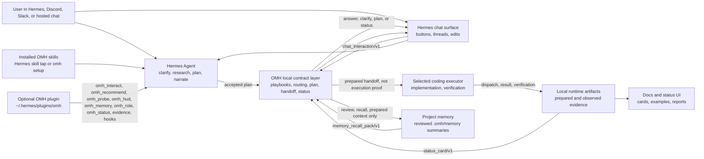

# Architecture

## Goals

The product direction is defined in `docs/DIRECTION.md`; this architecture
document describes the current module boundaries that implement that direction.

This is an agent, wrapper, and maintainer reference. The normal human surface is
Hermes chat plus `omh setup`, `omh update`, and `omh doctor`; backend command
groups described here are integration contracts rather than user workflow.

oh-my-hermes should feel like a native Hermes workflow layer, not a pile
of copied prompt files.

The architecture favors:

- Hermes-native skill installation as the primary user-facing entry point
- a thin Hermes plugin bridge for workflow recommendation, capability probing,
  and metadata-only HUD/status context
- a small support command interface for bootstrap, verification, and wrappers
- reversible local bootstrap installation
- generated skill text from testable catalog data
- explicit compatibility contracts
- reviewed project-local memory as prepared context, not execution evidence
- conservative routing behavior
- delegation-first coding, where Hermes plans and narrates while the selected
  coding executor performs main implementation work

## System View

This is the product architecture, not the package tree. Wrappers render chat
UX, OMH produces deterministic local contracts, Hermes keeps user-facing
reasoning, and executor lanes provide observed coding evidence only after a
separate runtime record exists.



```text
Chat user
  -> Hermes Agent owns conversation, planning, and status narration
  -> Installed OMH skills provide workflow and evidence guidance
  -> Hermes chat surface asks OMH for backend contracts
  -> Executor owns main coding work when dispatched
  -> Runtime artifacts own observed evidence
```

## Package Layout

```text
src/
  omh/
    __init__.py              # public package shim; maps source folders below into omh.*
    cli/                     # module entry point package for omh.cli and python -m omh.cli
    chat_router.py           # compatibility facade to routing/chat.py
    recommend.py             # compatibility facade to routing/recommend.py
    coding_delegation.py     # compatibility facade to coding/coding_delegation.py
    runtime_artifacts.py     # compatibility facade to runtime/artifacts.py
    wrapper_contract.py      # compatibility facade to wrapper/contract.py

  commands/
    main.py                  # parser assembly and top-level error handling
    chat.py
    coding.py
    runtime.py
    setup.py

  routing/
    chat.py
    intent.py
    localization.py
    policy.py
    recommend.py
    route_plan.py
    task_cards.py

  workflows/
    materials.py
    operations.py
    paper_learning.py
    research_department.py
    source_finder.py
    visual_summary.py
    workflow_learning.py

  coding/
    coding_contracts.py
    coding_delegation.py
    codex_progress.py
    executor_progress.py
    executor_readiness.py
    executors.py
    isolation.py
    team_readiness.py
    worktree_creator.py

  install/
    command_path.py
    config_adapter.py
    installer.py
    manifest.py
    plugin_pack.py
    plugin_observations.py

  maintenance/
    doctor.py
    probe.py
    release.py

  mcp/
    bridge.py

  quality/
    capability_roadmap.py
    grounded_score.py
    harness_quality.py
    parity.py

  surfaces/
    context.py
    demo.py
    hud.py
    menubar_app.py
    menubar_status.py
    quickstart.py

  system/
    hashutil.py
    ingress.py
    local_store.py
    paths.py
    targets.py
    workflow_state.py

  catalogs/
    playbooks.py
    roles.py
  profiles/
    setup.py
    team.py
  runtime/
    artifacts.py
    records.py
  wrapper/
    contract.py
    executor_sessions.py
    lifecycle.py
    sessions.py
  core/
  skills/
    catalog.py
    packaging.py
    render.py
  plugin_bundle/
    omh/
      plugin.yaml
      config.yaml
      hooks/
      tools/
skills/
  <skill-name>/SKILL.md       # tap-compatible Hermes skill pack generated from the same catalog
```

## Main Modules

`skills/` is the Hermes-native distribution surface. It mirrors the generated
skill templates so `hermes skills tap add rlaope/oh-my-hermes` can expose
OMH directly when Hermes taps are available.

`plugin_bundle/omh/` is the Hermes plugin payload installed by `omh setup` to
`~/.hermes/plugins/omh`. The v1 plugin registers deterministic
`omh_interact` chat/session interaction, `omh_recommend` route hints,
metadata-only `omh_probe` capability status/roadmap, compact metadata-only
`omh_hud`, detailed metadata-only `omh_status`, `omh_role` role context, a
bounded `omh_gather_evidence` local verification probe, and passive lifecycle
hooks for bounded status context, role marker validation, and metadata-only
session-end checkpointing. The
`pre_llm_call` hook can also add
`omh_context_brief/v1` plus `omh_route_hint/v1` for messages that look like
planning, research, ops, materials, visual summary, automation,
workflow-learning, or coding-handoff work. That hook payload carries only
hash/length metadata, matched cue labels, candidate workflow names, next
actions, generic-tool checkpoint rules, and boundaries; it does not include the
raw user message or prove a workflow executed. For capability/catalog questions,
the context brief adds `omh_catalog_question_hint/v1` so Hermes can show the
workflow picker or capability summary without shell approval. The `pre_tool_call` hook mirrors
the generic-tool checkpoint as structured `omh_generic_tool_checkpoint/v1`
metadata before image, file, search, or coding tools, while preserving the
legacy text context for hosts that only consume prompt strings. It uses only
tool labels and tool-family hints, never raw tool input. `omh hud`
exposes the same status-line payload for local operator smoke tests. The HUD
line stays limited to version, plugin bridge readiness, target topology, current
or default coding agent, and evidence state. Host-supplied token metadata
remains available in the machine-readable payload but is not shown in the
Hermes-facing status line.
It intentionally omits install inventory such as managed skill counts. Its
evidence probe is allowlisted, shell-free, bounded to a project root, and emits
truncated structured command output. It does not provide an arbitrary shell,
patch Hermes core, or claim execution evidence from prepared handoffs. Role
context is prompt guidance only; it is not proof
that a separate role, worker, or executor ran.

`menubar_status.py` owns the platform-neutral macOS menu bar view model exposed
by `omh menubar status --json`. Its `menubar_status/v1` payload is a UI
projection over the same local HUD, target registry, and runtime evidence. It is
intentionally not the source of truth. The payload separates `hermes_agents` from
`external_coding_executors` so Codex, Claude Code, OMX, OMO, OMC, or generic
coding tools cannot be rendered as Hermes agents by accident. Compact surfaces
receive source and model `icon_id` values plus tooltip text rather than Markdown
tables or prose-only labels. `display.menu_cards` is the human-facing card model
for the native menu bar helper, grouping the same contract into Agent Status,
Coding Agent, and Evidence sections so compact UI surfaces do not need to render
raw JSON-like text. The Agent Status section uses an explicit `Agent | PID |
Status` row shape.

Plain `omh menubar status` renders a short terminal summary from the same
payload so operators see Summary, Agent Status, Coding Agent, Evidence, and
Observation sections without reading raw JSON. Machine consumers should request
`--json` or set `OMH_OUTPUT=json`.

`current_external_coding_executor` names the selected row explicitly, preferring
`runtime/state.json` `last_run_id` when it matches the recent executor list, so
settings and compact summaries do not rely on an unnamed list-order convention.

`workflows/memory.py` owns OMH project memory. It stores candidates, reviewed
records, review decisions, and recall packs under `.omh/memory/` using local
JSON files. Setup records `project_memory_policy/v1` with `off`,
`review-first`, or `auto-safe` mode. Coding handoffs can receive
`memory_recall_pack/v1` when reviewed records are relevant. These packs are
prepared context only; they are not execution, review, CI, merge, or Hermes
internal-memory evidence.

The menu bar status contract reports configured Hermes targets and prepared
handoffs without inventing process state. PID, `running`, and `restarting`
values are applied only from a caller-provided `menubar_process_overlay/v1`
payload or an explicit `omh menubar status --observe-local-processes --json`
request from the native macOS helper. That observation is app-local, expires
after a short TTL, and applies restarting state only inside its restart window.
OMH does not turn prepared handoffs into observed execution, review, CI, or merge
evidence. Plain `omh menubar status` remains metadata-only, even though its
default terminal output is human-readable.

`cli.py` is a compatibility adapter. `commands/main.py` owns parser assembly,
top-level error handling, and the public command handler re-export surface.
Domain command modules under `commands/` own support JSON output for bootstrap,
repair, verification, wrapper backends, and operator debugging. New command
handlers should be added to the matching domain module rather than growing
`commands/main.py`.

`ingress.py` owns platform-neutral message text and source metadata extraction
for Discord, Slack, Hermes, and generic wrapper event shapes.

`targets.py` owns the deterministic Hermes target registry. It records which
Hermes home, wrapper target, or agent reference was observed, derives
`omh_target_topology/v1`, and keeps single-target versus multi-target behavior
as setup evidence rather than runtime execution proof.

`routing/chat.py` owns deterministic pre-dispatch routing decisions for chat
wrappers. It consumes plain messages or platform-shaped event payloads and
returns `dispatch`, `clarify`, or `fallback` decisions from local catalog data.
`routing/localization.py` owns deterministic locale phrase expansion for common
non-English operator requests. It preserves the raw message, adds only canonical
scoring hints, and makes locale-match metadata available to scored
recommendations without calling translation services.
`wrapper/localized_copy.py` owns the separate human-facing chat copy catalog for
common localized card frames. It can mirror the user's language for supported
operator-facing cards, but it does not translate raw prompts, change routing
scores, or turn prepared states into observed evidence.
`routing/policy.py` owns shared confidence and ambiguity policy, and
`routing/recommend.py` owns local catalog recommendation scoring.

`coding_delegation.py` owns deterministic coding handoff preparation. It maps
implementation-shaped task text to an action, intent, workflow, harness,
executor profile, acceptance criteria, and verification expectations without
LLM, API, or network calls.

`wrapper/contract.py` owns the platform-neutral chat interaction contract. It
composes routing, planning, delegation, and status primitives into a
`chat_interaction/v1` envelope with a renderable `chat_response/v1`, safe action
buttons, a stable thread key, and overclaim guards for Discord, Slack, and
hosted Hermes adapters.

`wrapper/lifecycle.py` owns Codex-oriented lifecycle helpers above the existing
runtime artifact layer. It starts prepared handoffs, records dispatch and
executor observations, records verification observations, and reports derived
status without mutating prepared handoff records into execution proof.

`wrapper/executor_sessions.py` owns wrapper-native executor session metadata.
It turns Hermes actions such as Start Codex session, Start Claude Code session,
Attach coding session, Refresh status, Record completed, Record blocked, and Ask
Hermes to verify into `executor_session/v1` records and status lines. It can
bridge to the Codex lifecycle run or a runtime-start observation when Hermes or
the wrapper reports an observed coding-session start/attach event. OMH still
does not secretly launch Codex, Claude Code, Hermes, workers, worktrees, or
network transports; it tells Hermes what to start and records what Hermes or the
wrapper actually observed.

`hermes_planning.py` owns deterministic Hermes-facing planning artifacts under
`.hermes/plans/` and the machine-readable plan wrapper contract used after plan
acceptance.

`runtime/artifacts.py` and `runtime/records.py` own local JSON/JSONL evidence,
schema validation, redacted export, and derived delegated coding status.
They also own `runtime_observation/v1`, the runtime-level observation ledger for
Hermes, OMX, OMO, and OMC handoffs. Each record names one observed or blocked
ladder step such as runtime start, worktree creation, worker dispatch, worker
result, verification, review, CI, merge readiness, or merge. Missing records
remain missing evidence; OMH does not infer them from prepared handoff text.

`workflow_learning.py` owns the metadata-only learning plane above routing,
wrapper sessions, and runtime artifacts. It projects workflow attempts into
`workflow_learning_trace/v1`, evaluates them with deterministic
`workflow_eval_result/v1` rubrics, creates review-only
`improvement_candidate/v1` records, and stores `regression_case/v1` fixtures for
future replay. It is deliberately projection-first: trace recording does not
mutate skills, patch Hermes, train a model, or upgrade prepared work into
observed evidence. This gives Hermes good process data to review while keeping
status, verification, CI, merge, and skill changes separately observed.
`omh learning missed-route` composes those primitives for the common wrapper
case where Hermes did not use the expected OMH workflow; it records review
material and an optional minimized replay fixture, not an automatic fix.

`wrapper/sessions.py` owns metadata-only chat session persistence for wrappers.
It records chat continuity, plan decisions, and a link to a prepared run id, but
it does not own execution, review, CI, merge readiness, or merge evidence.

`installer.py` owns managed skill writes, manifest updates, update behavior, and
uninstall behavior.

`config_adapter.py` owns the Hermes config edit boundary. It should remain
small, heavily tested, and conservative.

`skills/catalog.py` owns workflow names, descriptions, trigger phrases, and
use-when rules as data.

`catalogs/playbooks.py` owns situation-level pipeline data. Playbooks sit above
individual skills: they describe common wrapper-visible paths for research,
interview, planning, coding handoff, local pipeline buildout, and
release-readiness review. `playbooks.py` remains only as a compatibility
adapter.

`catalogs/roles.py` owns the wrapper-visible responsibility-role catalog.
Roles are descriptors for chat/status clarity, not runtime agent evidence.
`roles.py` remains only as a compatibility adapter.

`profiles/setup.py` owns setup profile categories, executor defaults, and the
selected operating model recorded by `omh setup --operating-model <id>`.
Operating models are lightweight collaboration defaults such as solo operator,
small team, research ops, or coding runtime team. They change routing and
status narration defaults; setup state persists only the stable
`operating_model_id`, not a mutable catalog snapshot. They do not install
visible role files or prove that Hermes spawned agents. `profiles/team.py` owns
optional team profile packs such as CTO/PM-style role files. `setup_profiles.py`
and `team_profiles.py` remain only as compatibility adapters.

`skills/render.py` owns generated `SKILL.md` content. It should render from the
catalog rather than becoming a second source of truth. `skills/packaging.py`
owns assembly of the managed skill bundle from rendered templates.

`chat_router.py`, `recommend.py`, `runtime_artifacts.py`,
`runtime_records.py`, `wrapper_contract.py`, `wrapper_sessions.py`,
`coding_lifecycle.py`, `playbooks.py`, `roles.py`, `setup_profiles.py`,
`team_profiles.py`, `cli.py`, and `skill_pack.py` are compatibility facades so
older imports keep working while the package grows internally. Facades should
stay thin and point at the deeper source-owner modules.

## Routing

Routing, planning, and delegation have these local surfaces:

1. Hermes-native installed skills. The tap-compatible `skills/` directory and
   the managed `~/.omh/skills` bootstrap directory expose the same generated
   guidance to Hermes.
2. Prompt-level guidance. The router skill gives Hermes a structured map of
   workflow names and strong trigger phrases, but it does not override Hermes
   core behavior.
3. Situation playbooks. `omh playbook recommend` lets wrappers map a natural
   request to a higher-level pipeline before they choose a lower-level skill,
   plan, research lane, or handoff.
4. Task abstraction cards. `omh_task_card/v1` lets wrappers classify work such
   as runtime portability, environment reproduction, or router-design feedback
   before selecting a workflow. The card names operation primitives, workflow
   rails, risk domains, and prepared/observed boundaries, so a request like
   "reproduce this Hermes setup on another MacBook" is not collapsed into a
   narrow migration workflow.
5. Wrapper-native chat orchestration. Plugin `omh_interact` and
   `omh chat interact` let Discord, Slack, or hosted Hermes wrappers receive
   one platform-neutral `chat_interaction/v1` envelope with renderable chat
   copy, state, action buttons, and a thread key.
6. Wrapper session persistence. `omh chat session` lets wrappers persist
   metadata-only plan decisions, recover status by `session_id`, and link an
   accepted plan to a prepared coding run without owning execution evidence.
7. Wrapper-native executor session actions. After a handoff is prepared, the
   wrapper can render action buttons and record observed open/attach/result or
   verification-request events as `executor_session/v1` metadata. This is the
   layer that lets a Discord or Hermes chat user ask "what is happening with
   Codex or Claude Code?" without typing backend commands.
8. Wrapper-assisted chat routing. `omh chat route` lets Discord, Slack, or
   hosted Hermes wrappers run a deterministic pre-dispatch decision before they
   forward a plain user message to Hermes.
9. Wrapper-assisted coding delegation. `omh coding delegate` lets wrappers turn
   implementation-shaped messages into a deterministic `coding_delegation/v1`
   handoff payload for an executor lane.
10. Runtime observation recording. `omh runtime observe` lets wrappers or
   operators append observed lifecycle events into
   `.omh/runtime/journal/events.jsonl` and, for runtime handoffs, maintain
   `runtime_observation/v1` compatibility without implying unrecorded worktree,
   worker, verification, review, CI, or merge steps.
11. Hermes-facing planning artifacts. `omh hermes plan` lets wrappers or
   operators create deterministic `hermes_plan/v1` planning scaffolds under
   `.hermes/plans/` without claiming that execution or review already happened.

`omh_interact` is the plugin-native Hermes-facing entry point for this
contract, and `omh chat interact` is the CLI/backend equivalent. They compose
the lower-level surfaces into one response envelope so each Hermes Agent
surface can share the same orchestration policy. The `chat_response/v1`
subobject is safe to render directly: it names the state, provides concise
copy, exposes platform-neutral actions, and never asks the end user to run an
`omh` command. The surrounding envelope preserves source metadata, message hash
and length, thread key, selected mode, next action, redaction policy, and claim
boundary. Metadata-only session records also include `record_provenance` so a
plugin-authored record and a wrapper/backend-authored record are distinguishable
without upgrading either one into execution evidence.

The routing and delegation surfaces read from the same catalog metadata. The
chat router returns a `routing_instruction` and `routing_prompt_template` for
custom wrappers to forward, with raw-message prompt expansion available only
through `--include-message`. Coding delegation returns a
`delegation_prompt_template`, recommended workflow, harness, acceptance
criteria, verification expectations, and optional metadata-only
`coding_delegation.json` evidence. With `--executor choose`, it returns a
human-in-the-loop executor-choice contract. With `--executor codex`, it also
returns a `coding_executor_handoff/v1` instruction payload that names Codex as
the executor target without launching Codex. Codex handoffs include
`codex_skill` and `codex_invocation.dispatch_text_template`, so a wrapper can
turn a Hermes workflow into the Codex `$skill {message}` surface while still
keeping the raw message out of persisted OMH artifacts. Claude Code and generic
profiles return a `coding_prompt_handoff/v1` prompt-only payload that must not
create a lifecycle run or observed execution evidence. Hermes, OMX, OMO, and OMC
profiles return a `coding_runtime_handoff/v1` contract with runtime profile,
team/swarm, worker-protocol, and worktree guidance. Runtime handoffs are still
prepared state only: they do not mean Hermes, tmux, workers, subagents, or
worktrees were started. All coding handoff modes also include
`worktree_session_isolation/v1`, which tells wrappers whether the current
workspace is acceptable, an isolated worktree is recommended, or an isolated
worktree is required before opening an executor. That record stores a compact
snapshot of the generated workspace policy. Worktree creation itself is deferred
to native tooling — upstream Hermes manages worktrees for you (Kanban
worktree-per-task since v0.15.0, Desktop Projects since v0.18.0), or you can run
`git worktree add` manually — so OMH no longer creates worktrees and cannot
collide with the one Hermes is already managing for a task. When a worktree
exists, OMH records `omh_worktree_observation/v1`; that observation is
workspace-isolation evidence only. `omh worktree bind` can then return a
wrapper recipe for opening or attaching Codex, Claude Code, Hermes, or another
runtime from that worktree; the recipe is still not executor dispatch or result
evidence. Runtime ladders still need a separate `runtime_observation/v1`
`worktree_creation` event when the created worktree is attached to a prepared
runtime handoff. The coding handoff also stores acceptance criteria,
verification expectations, report contract, and evidence contract,
runtime-specific invocation templates, and the
`runtime_observation/v1` recording contract, but not the raw prompt body. With
`--record`,
the companion `run.json` is marked as
`artifact_kind: prepared_coding_delegation`, `phase: prepared`, and
`observation_status: prepared_not_observed`; validation treats the run envelope
and `coding_delegation.json` as a required pair. The run envelope is
implementation bookkeeping, not proof that Hermes executed the handoff.

The wrapper contract and lower-level surfaces are local contracts; execution
evidence still comes from Hermes Agent and the selected executor/runtime. The
append-only observation journal is the bridge between "prepared" and "observed"
lifecycle status. For Hermes/OMX/OMO/OMC runtime handoffs, the
legacy-compatible runtime observation ledger is mirrored into that journal. A
wrapper can record `runtime_start` while `worktree_creation`, `worker_dispatch`,
`worker_result`, `verification`, `review`, `ci`, `merge_readiness`, and `merge`
remain explicitly missing.

### Executor-local workflow binding

Coding handoffs may carry one optional `executor_local_workflow/v1` object for
the final guarded workflow. The workflow must have a canonical ID in the
routable skill catalog; workflows outside that catalog omit the binding. The
object is a prepared, task-scoped candidate, not a discovery result,
installed-skill claim, or execution instruction. When present, its exact root
keys are `schema_version`, `profile`, `status`, `routed_workflow`, `candidate`,
`availability`, `dispatchability`, `fallback`, and `claim_boundary`. The
candidate has exactly `kind`, `skill_id`, `invocation`, `rationale`, and
`selection_basis`; the invocation has exactly `mode`, `syntax`, `template`, and
`message_placeholder`.

The profile mapping is deliberately narrow:

| Profile | Candidate kind | Invocation representation | Dispatch rule |
| --- | --- | --- | --- |
| `codex` | `codex_skill` | `command_template`, `$<canonical-skill> {message}` | Only an exact matching `observed_available` record may make the candidate invocation dispatchable, and the parent handoff must remain `ask_before_dispatch`. |
| `hermes` | `hermes_installed_skill` | `display_only`, `/<display-name> {message}` | Always non-dispatchable display metadata. |
| `omx-runtime` | `omx_skill` | `display_only`, `$<canonical-skill> {message}` | Always non-dispatchable display metadata. |
| `omo-runtime` | `omo_skill_reference` | `skill_reference`, empty template | Non-executable reference only; no `load_skills` payload is serialized. |
| `omc-runtime` | `omc_skill_descriptor` | `descriptor_only`, empty template | Non-executable descriptor only; no universal slash command is inferred. |

`claude-code`, `generic`, `choose`, `pi`/generic aliases, and unmapped
profiles omit the binding entirely. OMH has no `pi` profile: a pi or generic
alias is treated as an unmapped generic boundary, not as a new executor.
Canonical Hermes display names come from the catalog (for example,
`ultragoal` displays as `/ulw-goal` and `ultrawork` as `/ulw-work`); the
canonical `skill_id` remains unchanged in the metadata.

Availability is an evidence state machine, not an installation probe. The
root `status` mirrors `availability.status` and is one of `unknown`,
`observed_available`, or `observed_unavailable`. `unknown` is the prepared
default and also covers missing, malformed, stale-profile, stale-skill, or
out-of-scope evidence. `observed_available` and `observed_unavailable` require
an explicit operator-recorded capability snapshot. Its scope must contain
exactly the matching `profile` and `skill_id` plus a canonical local
`environment`, and its `evidence_ref` must be a safe opaque
`namespace:identifier` reference. Its timezone-aware `observed_at` must be no
later than the snapshot `recorded_at` and no more than 24 hours older. OMH does
not probe `PATH`, scan skill directories, load a skill body, install anything,
or invoke an executor to produce this state. A matching observation says only
what that observation recorded at that time; it never proves invocation,
dispatch, execution, verification, review, CI, merge readiness, or merge.

The availability object has exactly `status`, `basis`, `profile`, `skill_id`,
`scope`, `recorded_at`, `observed_at`, and `evidence_ref`. Its `basis` is
`prepared_mapping` for `unknown` and `operator_recorded_snapshot` for either
observed state. The scope is bounded and nonsensitive; it is not a filesystem
listing or a transcript.

The dispatchability object has exactly `handoff_dispatchable`,
`candidate_invocation_dispatchable`, and `reason`. `reason` is restricted to
`availability_not_observed`, `candidate_observed_unavailable`,
`parent_handoff_prepare_only`, `descriptor_only`, and
`observed_available_ask_before_dispatch`, and must agree with the state and
parent lane. Runtime, Hermes display, OMX display, OMO reference, and OMC
descriptor candidates are never dispatchable.
For unknown or unavailable Codex candidates, the actual executor prompt and
legacy `codex_invocation.dispatch_text_template` remain the generic
`{message}` placeholder. The candidate metadata may still display the
prepared `$<canonical-skill> {message}` shape, but it cannot authorize use.
They retain the exact fallback
`Keep the parent handoff prompt and dispatch mode unchanged; do not invoke the candidate.`
Every binding carries the exact claim boundary:
`Prepared executor-local workflow metadata is not evidence of installation, loading, invocation, dispatch, execution, verification, review, CI, merge readiness, or merge.`

The binding is projected consistently, when present, through direct coding
delegation, routed delegation, wrapper session state, briefing/work-summary
metadata, persisted replay, and the wrapper golden contract. Each projection
copies the bounded object; none synthesizes a command or copies a raw prompt,
local path, skill body, transcript, or evidence contents. Manual QA for a
projection must capture the parsed schema, profile, status, skill id,
invocation mode/template, both dispatchability booleans, and the parent lane's
dispatch mode. A missing capture is missing observation, not a positive claim.

The boundary follows pinned upstream evidence. OMO's skill-loader descriptors
contain richer loader metadata than a portable OMH invocation contract, and its
task tool injects skill contents at spawn time; see the pinned
[`b072d279` descriptor types](https://github.com/code-yeongyu/oh-my-openagent/blob/b072d279110bdda2c6ac2525d0d24dc54d16148/packages/skills-loader-core/src/features/opencode-skill-loader/types.ts#L26-L37)
and [`b072d279` task skill loading](https://github.com/code-yeongyu/oh-my-openagent/blob/b072d279110bdda2c6ac2525d0d24dc54d16148/packages/senpi-task/src/tools/task/skills.ts#L17-L23).
OMC's pinned, bounded skill discovery and user-skill compatibility helpers do
not define a universal slash-command grammar; see the
[`41a4c0f` discovery path](https://github.com/Yeachan-Heo/oh-my-claudecode/blob/41a4c0f77144c5beb5f5f000a89cff379c680606/scripts/skill-injector.mjs#L517-L563)
and [`41a4c0f` compatibility helper](https://github.com/Yeachan-Heo/oh-my-claudecode/blob/41a4c0f77144c5beb5f5f000a89cff379c680606/src/utils/user-skill-compat.ts#L48-L89).

Hermes planning writes Markdown plans under the configured Hermes home rather
than runtime JSON under `.omh/runtime/`. The artifact is user-facing: it includes
the task statement, goals, non-goals, options, risks, acceptance criteria,
verification, execution handoff guidance, and reviewer status. Review gates
default to `not_observed` unless wrapper metadata proves a separate review ran.
Weak requests create a companion `.hermes/context/` artifact and keep the plan
`blocked` until Hermes asks the smallest blocking clarification.

The machine-readable planning bridge is stdout JSON plus the accepted plan
artifact, not a Discord/channel summary. Each `hermes_plan/v1` payload includes
`wrapper_contract` with the current wrapper step, decision gate, optional
recorded plan artifact path, and coding-delegation handoff template. For
implementation-shaped draft plans, `wrapper_contract.coding_delegate.argv_template`
is the adapter contract for calling
`omh coding delegate --executor codex --record --from-plan <accepted-plan.md>`
after plan acceptance. `omh coding delegate --from-plan` rejects draft plans by
default and uses the accepted artifact or generated context pack as executor
context when the wrapper wants a run-backed Codex handoff and a future
`runtime.run.run_id`. Blocked or non-coding plans keep `coding_delegate.available`
false so wrappers do not infer execution from presentation text.

`omh chat session` is the recovery layer for adapters that need button/thread
state to survive restarts. The session id is derived from `thread_key`. Session
records own chat continuity, route summary, plan accepted/revision/cancelled
decisions, and a `current_run_id` link. The linked run remains the only
authoritative source for prepared handoff, dispatch, executor result,
verification, review, CI, merge readiness, and merge observations.

`executor_session/v1` is the chat-facing companion to that recovery layer. It
records that a wrapper observed an open/attach/result/verification-request
event for the selected executor. For Codex, observed open maps to lifecycle
dispatch and observed result maps to the Codex run ledger. For Claude Code and
generic agents, it remains prompt-only session metadata. For Hermes/OMX/OMO/OMC
runtime handoffs, observed open records `runtime_start` while later ladder
steps remain missing until explicit `runtime_observation/v1` evidence exists.

Future routing work should deepen the catalog first, then render richer skill
metadata from it.

The delegation-first completion model is tracked in
`docs/DELEGATION_FIRST_COMPLETENESS.md`. It is the product boundary for making
OMH feel more complete without turning Hermes into the main coding executor.

## Hermes Capability Boundary

`omh probe` is the non-mutating capability inspection surface. It reports
observable local evidence for:

- external skill directory registration
- managed skill installation
- hook-like files
- plugin and app paths
- MCP bridge server availability, setup preference, runtime tool-call
  observation, host session observation, and MCP host config paths as separate
  capabilities
- wrapper observation artifacts
- native skill metadata readiness

Probe results use `available`, `missing`, `unknown`, or `unverified`. A file or
directory probe marked `unverified` is not a native integration claim. Deeper
Hermes integration requires both a stable Hermes extension contract and runtime
evidence that the extension ran.
`mcp_bridge_server` is the installed stdio bridge command, `mcp_preference` is
OMH setup state only, `mcp_bridge_runtime` is a local OMH-observed bridge tool
call, `mcp_host_session` is host/wrapper-supplied load or session evidence, and
`mcp_host_config` is a host-file probe only. Keeping them separate prevents a
requested bridge preference or config file from being mistaken for observed MCP
host load, connector invocation, or coding execution.

The MCP bridge is intentionally narrow. `omh mcp serve` speaks newline-delimited
stdio JSON-RPC and exposes only `omh_status`, `omh_recommend`, and `omh_probe`;
`omh_probe` can include parity and capability-roadmap projections when a host
requests those advisory views.
`omh mcp config-recipe --host ...` can print host-shaped config snippets for
Claude Code, Codex, OpenCode, Cursor, and generic MCP hosts. `omh setup
--with-mcp --mcp-host ...` can write supported host config files directly when
the operator explicitly requests MCP host setup. That written config remains
configuration evidence only. The bridge does not expose arbitrary shell
commands, call external APIs, dispatch coding executors, or prove a specific
Hermes host loaded the bridge.
When a host or wrapper does observe bridge load or use, it can record
`omh_mcp_host_session/v1` through `omh mcp observe-host`; observed records
require an evidence reference and remain host-load/session evidence only.

Plugin runtime load uses a parallel contract. Local plugin install and
import/register smoke prove only the copied bundle. A Hermes host or wrapper can
record `omh_plugin_host_observation/v1` with `omh plugin observe-host` after it
actually sees plugin load, status query, session end, or unload. Invoked OMH
plugin tools/hooks can also self-record the same observation schema when the
host supplies bounded `observation` metadata. That observation can make
`plugin_runtime_observed` available in `omh probe`, but it still proves only the
recorded plugin event. Active native readiness is narrower: only `plugin_load`,
`tool_call`, `hook_call`, and `status_query` observations keep
`native_integration_claim_ready` true. `blocked` is descriptive host metadata
and `session_end`/`plugin_unload` are historical
runtime evidence, not active readiness.

For terminal operators, `omh probe` prints a compact status summary by default.
Wrappers and automation should request the full capability payload with
`omh probe --json` or `OMH_OUTPUT=json`.

`omh probe --parity` adds `omh_parity_matrix/v1`. That matrix compares common
oh-my runtime capability axes with OMH's actual surfaces: skill/plugin
distribution, specialist roles, team/swarm workers, worktree isolation, HUD and
session observability, MCP/tool bridge, loop/autopilot workflow, and
release maintenance. It is a product and operator contract, not a hidden runtime
claim. Team/swarm worker support is exposed as `omh_team_worker_readiness/v1`
through `omh runtime team-readiness`: OMH can show the worker protocol, runtime
templates, wrapper actions, installed skill visibility, and observed
`runtime_observation/v1` ledger status. That readiness is still not worker
launch, pane/session creation, worker result, review, CI, or merge evidence.
Worktree isolation is observation-only: the `omh worktree list/bind` backend
reads its local `omh_worktree_observation/v1` ledger and returns wrapper binding
recipes for a worktree that native Hermes/Git tooling created; it neither
creates worktrees nor auto-launches an executor. MCP host load and plugin runtime events likewise
belong to Hermes, the selected executor, or another observed integration until
the matching ledger records exist.

## Harness Contract

Representative harnesses are preview metadata for generated prompt guidance.
They are not separate runtime roles, hidden hooks, or proof that Hermes exposes a
matching internal role system.

Runtime artifacts make that boundary inspectable. A harness can request local
evidence under `.omh/runtime/`, but the artifact must separate requested
delegation from observed delegation. If Hermes or a wrapper does not expose a
specialist lane result, the recorded result stays `not_observed` or
`not_available`.

When a harness is added, removed, or renamed, update these surfaces together:

- `src/skills/catalog.py`
- `src/skills/render.py`
- `docs/APPLICATION_CASES.md`
- `tests/test_router_content.py`

Each harness must also define runtime evidence expectations in catalog data:

- artifact event names
- delegation expectation
- privacy default

This keeps the generated router, public examples, and regression tests aligned
around one catalog contract.

## Runtime Artifacts

Runtime artifacts are local JSON/JSONL files under `.omh/runtime/`.

```text
.omh/
  targets.json
  runtime/
    state.json
    executor-readiness.json
    executor-limit-signals.json
    runs/
      <run-id>/
        run.json
        events.jsonl
        routing.json
        coding_delegation.json
        delegation.json
        wrapper.json
        evidence/
    journal/
      events.jsonl
      external_effect_receipts.jsonl
      external_effect_mint_failures.jsonl
    wrapper_sessions/
      <session-id>/
        session.json
        events.jsonl
```

`executor-limit-signals.json` (written under a transient `.lock` sibling) keeps, per executor profile, the last observed
limit-shaped dispatch failure (timestamp, run ref, pattern label only — never
matched text). It is advisory ranking metadata for executor choice, not
provider quota truth.

`targets.json` records observed Hermes target topology for setup drift, including
single-to-multi and multi-to-single changes. `state.json` records install,
apply, and doctor summaries. A run directory
records a workflow envelope, append-only events, routing decisions, prepared
coding delegation, delegation observation, and wrapper observation plus optional
evidence files. A wrapper session directory records chat-thread continuity and
plan decisions only; it may link to a run id but must not duplicate run-level
execution evidence.

The runtime artifact layer is intentionally small:

- JSON/JSONL only
- no external service
- no prompt body capture in runtime artifacts by default
- schema-versioned files
- CLI inspection through `omh runtime status`, `omh runtime runs`, and
  `omh runtime show <run-id>`
- schema validation through `omh runtime validate`
- redacted export through `omh runtime export`

### External Effect Receipts

`runtime/journal/external_effect_receipts.jsonl` is an append-only store of
`external_effect_receipt/v1` records: one per external effect an acting surface
observed. An external effect is something OMH cannot do — a message reaching a
chat platform, a review landing on a change, a CI run executing, a branch
moving. OMH only records that a surface which does act reported one.

The store is mint-restricted, in the same shape as the adapter-quality
prepared-vs-observed handshake:

- `action` is one of `message_sent`, `review_submitted`, `ci_run`, `merge`, and
  `acting_surface` is one of `adapter_quality_delivery`,
  `runtime_review_record`, `runtime_ci_record`, `runtime_merge_record`. Both are
  closed vocabularies with a real producer; there is no free-text surface.
- A receipt is minted only from a record whose own `observed` flag is true. An
  unobserved record is an intent, whatever its status says.
- `observed_result` is `attempted`, `succeeded`, `failed`, or `unknown`.
  `requested` and `attempted` are also reportable *projected* states: they come
  from the run's own records when the effect has no receipt at all, so a
  prepared or requested record can never become evidence.
- `succeeded` requires a non-empty `external_ref`. An observed success nobody
  can name is recorded as `unknown`.
- Retries and reversals append a new receipt linked through
  `supersedes_receipt_ref`. Nothing is rewritten, so history is structural. The
  chain is a line: a receipt cannot supersede itself, cannot supersede a receipt
  that does not already exist, and cannot supersede one something else already
  superseded.
- Minting is idempotent by effect identity. Recording the same observation of
  the same effect again appends nothing, so a record written three times has one
  receipt.
- An append terminates a torn tail first, so a short write cannot concatenate
  the next record onto a partial line and lose both.

Every field is metadata, and every string field is guarded by its class rather
than by name — the classes are declared in one place in
`workflows/external_effect_receipts.py` and enforced in all three places a
receipt is handled: `build_external_effect_receipt`,
`validate_external_effect_receipt`, and `compact_external_effect_receipt`.

- Identifiers — `receipt_id`, `effect_id`, `run_id`, `observed_at`,
  `external_ref`, `supersedes_receipt_ref`, and each `evidence_ref` — are opaque
  references validated through `require_opaque_metadata_ref`: bounded,
  non-navigable, never URLs, and free of control characters. `receipt_id` is in
  the class because it is what every success citation is built from. Rendering
  folds anything that is not opaque to a stable `ref-<digest>` handle, and
  `omh runtime export` redacts `external_ref`.
- `action`, `target_class`, `acting_surface`, and `observed_result` are closed
  vocabularies, enforced at render as well as at validate: a value outside the
  vocabulary is not a new state, so it renders empty and projects as `unknown`.
- `summary` goes through the same bounded free-text guard as every other summary
  in this repo: a link, a filesystem path, a secret, or a control character
  makes it `[redacted]` on the way in and a violation on the way back.

Producers call `mint_external_effect_receipt`, which never raises into them: a
receipt that cannot be stored must not fail the record that produced it.
Refusals and write failures come back as an `external_effect_mint_result/v1`
mapping and are appended to
`runtime/journal/external_effect_mint_failures.jsonl`, so an unreceipted effect
is visible rather than silent.

Consumers:

- `omh runtime show <run-id>` carries the run's receipts, tail-bounded like the
  rest of the run history.
- `omh runtime delegation-status` carries an `external_effects` projection
  splitting the run's effects into requested / attempted / succeeded / failed /
  unknown, and each of `review`, `ci`, and `merge` carries the receipt that
  backs it.
- The `ci_observed` and `merged` claim rungs require a `succeeded` receipt whose
  effect, action, and acting surface all match the gate being claimed. A
  `failed` or `attempted` receipt satisfies neither.
- `omh runtime receipts` is a read-only view, and its per-run roll-up is the
  same projection `omh runtime delegation-status` reports, so the two surfaces
  cannot print different effect counts for one run at one instant. There is
  deliberately no command that mints a receipt from operator input.

Both gate call sites — runtime validation and the projection the claim ladder
reads — name a run's effect through one run-identity resolver
(`external_effect_run_id`) and select its receipt through one ordering rule
(`select_effect_receipt`, latest in append order). The shared predicate could
never disagree with itself, but two call sites handing it different receipts
would have been the same divergence one step earlier.

What `omh runtime validate` does and does not say about receipts:

- The store is runtime-wide, so its own faults are reported once, at store
  level, under the `external_effect_receipts` key. A line that does not parse
  carries no `run_id` and therefore belongs to no run; it can never fault a run
  that had nothing to do with it. Validating one run considers only that run's
  receipts.
- A `ci passed` or `merge merged` record is faulted when a receipt for that
  effect *contradicts* it: the receipt observed the effect fail, or it names a
  different action or acting surface. A receipt that observed less (`attempted`,
  `unknown`) withholds the claim without condemning the record.
- The *absence* of a receipt is not a violation. Runs recorded before this store
  existed have none, and validation describes whether the records on disk are
  internally consistent, not whether a newer artifact was written for them.
  Those runs stay valid and keep every claim rung through `review_observed`;
  what they cannot do is claim `ci_observed` or `merged`, because those two
  assert something happened outside this machine and nothing on record names the
  surface that saw it. The way forward is to record the gate again — `omh
  runtime ci` then `omh runtime merge`, each with the result the run already
  recorded — which mints the receipt and restores the claim. Those commands
  still refuse a status the run has not reached; a run that has already passed
  the gate sits at one of the completion `next_action`s (`report_merged`,
  `report_merge_ready`, `report_completion_with_evidence`), and from there the
  same record is a restatement rather than a transition, so the preflight admits
  it and no false intermediate record is needed. The exact sequence is in
  `docs/CODING-OBSERVABILITY.md`. Nothing mints a receipt for a past effect from
  operator input.

Bot wrappers can call `omh chat route --record` before invoking Hermes. The
record stores the selected skill, confidence, score, message length, and message
hash without storing the raw prompt body.

Bot wrappers can call `omh coding delegate --executor codex --record` for
implementation-shaped messages when they want a run-backed Codex handoff. The
record stores source metadata, action, intent, recommended workflow and harness,
acceptance criteria, verification expectations, recommendation evidence,
`message_sha256`, `message_length`, and status `prepared_not_observed`. That
status means a handoff was prepared; the companion run envelope is also marked
`prepared_coding_delegation`, not proof that Hermes executed the task.
Executor-choice, runtime-handoff, clarify, fallback, and prompt-only handoffs
return `runtime.recorded=false` and should stay in wrapper/session state.

### Prepared Runtime Run Executor Matrix

A `prepared_coding_delegation` run is not the generic shape of every coding
handoff. It is the run-backed lifecycle for one work-owner mode. Every executor
profile OMH models belongs to exactly one lane, and the lane decides whether a
runtime run exists at all:

| `work_owner_mode` | Executor profiles | Prepared handoff contract | `prepared_coding_delegation` run | Wrapper `current_run_id` link |
| --- | --- | --- | --- | --- |
| `external_executor` | `codex` | `coding_executor_handoff/v1` | required | required |
| `prompt_only_handoff` | `claude-code`, `generic` | `coding_prompt_handoff/v1` | forbidden | forbidden |
| `runtime_handoff` | `hermes`, `omx-runtime`, `omo-runtime`, `omc-runtime` | `coding_runtime_handoff/v1` | forbidden | forbidden |
| pending choice (`choose`) | none selected yet | executor-choice contract | forbidden | forbidden |

`external_executor` is the only run-backed lane today because
`coding_executor_handoff/v1` is the only handoff contract that carries the
dispatch, result, verification, review, CI, and merge ledger a run directory
validates. Its supported profile set is the `CODING_EXECUTOR_HANDOFF_TARGETS`
registry in `src/coding/executors.py`, currently `codex` alone. That is a
documented capability boundary, not an executor default: adding a second
run-backed profile is a capability decision that must extend the registry and
the profile-specific handoff validation together, not a special case inside the
validator.

`src/runtime/artifacts.py` validates against that registry rather than a
hard-coded profile name, and `PREPARED_RUNTIME_RUN_EXECUTOR_MATRIX` is the
single rejection sentence appended to every mismatch. A rejected record is told
which lane it belongs to, which profiles are run-backed, and which field made it
fail — a `claude-code` record stored as a runtime run is rejected both as a
prompt-only handoff and because its `work_owner_mode` is not
`external_executor`, while a record that reaches `external_executor` with an
unsupported or missing profile is rejected on `selected_executor_profile` or on
the absent `executor_handoff`. The same registry gates the wrapper-session link, so
a session cannot point `current_run_id` at a run whose
`executor_handoff.executor_target` is outside the run-backed set.

None of this changes evidence semantics. Accepting a run-backed profile keeps
`observation_status: prepared_not_observed`; rejecting a non-run-backed profile
is a schema error, never a downgrade or upgrade of observed evidence.

All three handoff contracts in that matrix carry a `task_authority_envelope/v1`
field group naming the authority the handoff was prepared under, and the
`coding_delegation/v1` record they ride on carries the `coding_action_gate/v1`
verdict that produced it. Neither is a record family of its own. See
[Task Authority Envelope](#task-authority-envelope) for the shape and for the
rules that keep authority and artifact from drifting apart.

Bot wrappers can still call `omh runtime delegate` after the response if
delegation metadata is available. If not, they should record `not_observed`
rather than guessing.

Wrappers can also call `omh runtime wrapper` to record whether a prompt was
dispatched, whether a Hermes response was observed, whether verification was
observed, and which gaps remain unobserved. This keeps bot integration evidence
separate from claims about Hermes internals.

Wrappers can call `omh runtime delegation-status --run <run-id>` to combine the
prepared coding delegation, delegation observation, and wrapper observation into
a `delegated_coding_status/v1` summary. The summary exposes `safe_summary`,
`next_action`, review readiness, verification observation, and an
`overclaim_guard` so chat adapters can report progress without implying Hermes
implemented the code.

`omh runtime progress bind|observe|status` is the live executor progress
surface for long Codex or external-coding runs. A wrapper binds a run or wrapper
session to an executor/process identity, then repeatedly calls `observe` with
incremental Codex JSONL or process-output snapshots. OMH summarizes the snapshot
into metadata-only signals, emits a compact `chat_report` only when the stage
changes, and suppresses duplicate/no-op snapshots through persisted binding
state. The latest event/report is projected by `progress status`, including
stale active bindings. These progress artifacts are not result, verification,
review, CI, merge-readiness, or merge evidence.

Wrappers that want one higher-level lifecycle surface can call
`omh coding lifecycle start|dispatch|result|verify|report`. These commands are
thin wrappers over the same runtime files: `coding_delegation.json`,
`delegation.json`, `wrapper.json`, and `events.jsonl`. They reject invalid
transitions such as result-before-dispatch, derive lifecycle status from
observed evidence, and keep review or verification gaps visible in
`chat_response/v1` status copy. Status interactions also expose
`status_card/v1`, a platform-neutral progress card with handoff, execution,
verification, review, CI, merge-ready, and merged steps. Wrappers can render
that card directly instead of inferring progress from prose.

`omh chat session status` also exposes `coding_briefing/v1` as a sibling to the
compact status card. The briefing is the richer Hermes-facing report surface for
delegated coding work: it combines persisted route/plan metadata, compact handoff
contracts, executor-session state, runtime evidence, review/CI/merge status,
pending evidence gaps, and `user_facing_lines[]`. It remains metadata-only: raw
prompts and full interview transcripts are not reconstructed, and merge-ready is
kept distinct from observed merge evidence.

## Hermes Planning Artifacts

Hermes-facing plans live under the configured Hermes home:

```text
.hermes/
  plans/
    <timestamp>-<slug>-<token>.md
  context/
    <timestamp>-<slug>-context-<token>.md
```

`omh hermes plan --record` writes Markdown, not runtime JSON. The plan frontmatter
uses `schema_version: hermes_plan/v1`, `status: draft` or `blocked`, the source
surface, and a review gate with `architect` and `critic` statuses. The command is
deterministic and local-only; it does not run review agents, call services, or
execute the plan. A `not_observed` review gate means the artifact is a planning
scaffold, not consensus approval.

The plan body and stdout payload include `quality_gate` and `deep_interview`
blocks. `quality_gate` names readiness, pass conditions, and evidence that must
be observed before stronger claims are safe. `deep_interview` tells wrappers
whether to ask exactly one blocking question, which decisions are missing, and
which action to take after the user answers.

The stdout `wrapper_contract.plan_artifact` mirrors the recorded artifact path
when `--record` is used. Wrappers should preserve the original message for later
delegation and use `wrapper_contract.message_field` only as the JSON pointer to
the message text inside the payload; they should not scrape the Markdown plan
body to recover commands or state.

## Workflow State

Workflow lifecycle state is stored separately from runtime run evidence under
`.omh/state/`.

```text
.omh/
  state/
    <workflow>-state.json
```

State files are the authoritative local lifecycle surface for adapted workflows:
active status, lifecycle outcome, timestamps, notes, and allowed handoff
metadata. Runtime runs under `.omh/runtime/` remain evidence envelopes for what a
wrapper or operator observed.

The CLI exposes the state layer through:

- `omh state start --workflow <name>`
- `omh state status`
- `omh state finish --workflow <name> --outcome finished`
- `omh state clear --workflow <name>`

Initial transition policy is intentionally conservative: clarification can hand
off to planning, and planning can hand off to execution or QA. Other active
workflow conflicts must be finished or cleared explicitly.

## Record Revisions and Idempotent Mutations

Wrapper sessions, goal ledgers, loop cycles, executor sessions, and workflow
state are shared local records: a chat wrapper, a CLI call, and an automation
tick can all reach the same JSON file. `src/system/record_revision.py` gives
those records one optimistic-concurrency contract.

Every guarded record carries up to three bookkeeping fields:

- `record_revision` — an integer that starts at `1` on the first write and
  increases by exactly one per applied mutation.
- `applied_mutations` — a bounded map of `"<operation>:<mutation_id>"` to
  `{"record_revision", "operation", "result_digest"}`, keeping at most
  `APPLIED_MUTATIONS_LIMIT` (128) of the most recent entries so records cannot
  grow without limit.
- `applied_mutations_floor_revision` — written only once eviction has actually
  dropped entries, and equal to the highest `record_revision` whose mutation id
  is no longer retained.

`guarded_record_update()` runs the whole read-modify-write inside one advisory
file lock: it reads the record inside the lock, replays an already-applied
mutation, compares `expected_revision`, applies the mutation, bumps
`record_revision`, validates, and only then writes atomically. Status
preconditions — a queue item still being `prepared_not_observed`, a session
still being in a decidable status — run inside that same transaction, so two
concurrent callers cannot both pass the same check.

Callers name the mutation and may guard it two ways:

- `operation` (**required**) — a short stable name for the logical mutation,
  such as `record_goal_checkpoint` or `record_plan_decision`. It scopes
  `mutation_id`, so it must not contain `:`.
- `expected_revision` — the `record_revision` the caller last rendered. When it
  no longer matches, the mutation raises `StaleRecordMutation` and **nothing is
  written**: the rejection is total, never partial.
- `mutation_id` — a client-chosen id for one logical intent. Retrying the same
  `(operation, mutation_id)` pair replays the original outcome instead of
  applying it twice, so a retried call creates no duplicate checkpoint,
  blocker, quality gate, queue observation, or session event, and does not bump
  the revision again.
- `mutation_digest` — optional; a digest the caller computes from its own
  arguments so a retry can be proven to mean the same thing.

Terminal records refuse new child work. `require_not_terminal()` backs the
refusal for cancelled wrapper sessions (executor selection, handoff
preparation, and every executor-session entrypoint) and for terminal goals —
`complete` and `cancelled` refuse checkpoints, blockers, and quality gates. The
refusal message names the terminal state so a wrapper can explain it.

### What the lock actually guarantees

The guarantees below hold **only while an OS file lock is held**:

- The read, every precondition check, the mutation, and the write happen as one
  transaction, so no concurrent writer can interleave between the
  `expected_revision` compare and the write it authorizes.
- No update is lost: each applied mutation bumps `record_revision` by exactly
  one.
- A `(operation, mutation_id)` pair applies at most once, even under concurrent
  retries of the same id.

The lock is taken on a `.<name>.lock` sidecar, never on the record itself:

- **POSIX** — `fcntl.flock` with `LOCK_EX | LOCK_NB`, polled until the timeout.
- **Windows** — `msvcrt.locking` with `LK_NBLCK` on one byte of the sidecar,
  released with `LK_UNLCK`, polled the same way. This is a real OS lock, so
  Windows gets the same guarantees as POSIX.
- **Neither module importable** — no OS lock exists. The transaction still
  runs, protected only by the `expected_revision` compare and the atomic
  replace, so concurrent writers can interleave and the "applies at most once"
  and "no lost update" properties **do not hold**. This is surfaced, not
  assumed away: `file_lock()` yields `{"locked": False, "enforced": False,
  "reason": "no_os_file_lock"}`, and `guarded_record_update()` returns a
  `GuardedRecord` whose `lock_enforced` attribute is `False` so a caller can
  say the guarantee was downgraded to best-effort instead of claiming it held.
  `lock_enforced` is an attribute of the returned dict and is never persisted
  into the record.

### Operation-scoped mutation ids

`mutation_id` is scoped by `operation`, and the pair is the replay key:

- **Same `operation`, same `mutation_id`** — replay. No write, no revision
  bump, no duplicate child item. The result is a `DuplicateMutationReplay`
  carrying the unchanged record and `replayed=True`.
- **Same `mutation_id`, different `operation`** — **not** a replay. A client
  turn id reused by a different operation is different logical intent and
  applies normally. Without this scoping a `goal cancel` that reused the id of
  an earlier `goal blocker` would be swallowed and exit successfully while the
  goal stayed active.
- **Same `(operation, mutation_id)`, divergent payload** — refused. When the
  caller supplies `mutation_digest` and it does not match the digest stored
  with the applied entry, the retry is different work sharing one id, and
  `ConflictingMutationReplay` is raised naming the operation and the id.
  `mutation_digest` must be used consistently within one operation: a retry
  that supplies a digest where the original call did not is treated as
  divergent rather than replayed, because silently dropping work is the worse
  failure.

### Eviction floor

`applied_mutations` is bounded at 128 entries, so a long-lived record does
eventually forget an old id. Forgetting is not silent. When entries are
evicted, `applied_mutations_floor_revision` moves up to the highest evicted
`record_revision`, and the retry rule becomes:

- id present in the map → replay, as above.
- id absent, `expected_revision` supplied and **at or below** the floor → the
  record cannot prove whether that mutation already applied. Applying it risks
  a duplicate and replaying it risks losing it, so `MutationHistoryEvicted` is
  raised, telling the caller to re-render the current record and retry against
  its current revision.
- id absent, no `expected_revision` or one above the floor → applies normally.

The consequence for callers: a retry is only guaranteed to be recognized while
its mutation is still within the most recent 128 applied mutations of that
record. Beyond that a retry carrying a stale `expected_revision` is refused,
never duplicated.

### Materialized mutation ids

The eviction floor only fires when the caller supplied an `expected_revision`,
and that asymmetry is deliberate: without one there is nothing to compare
against the floor, and refusing every id absent from the map would refuse every
legitimately new `mutation_id` once any eviction had happened. So a retry that
carries **only** a `mutation_id` gets no eviction protection from the map — and
the CLI accepts `--mutation-id` independently of `--expected-revision`.

The rule that closes that gap: **a surface that materializes a `mutation_id`
into a persisted item id must dedupe on that derived id inside its own locked
`mutate`, before appending.** The goal ledger does exactly this. It derives
`checkpoint_id`, `blocker_id`, and `quality_gate_id` from the `mutation_id`
(verbatim when the id is filesystem-safe, otherwise a stable hash), so the
record itself is the proof a retry needs: if an item with that id is already in
the target list, the mutation already applied. The mutator returns "no change",
the caller reports `replayed=true`, and `applied` stays re-derived from the
persisted record. This is exact, survives eviction, and costs one list scan.
The dedupe check runs before the mutator's other preconditions, matching the
`applied_mutations` replay path it backstops — that path never runs them
either, so a retry must not start failing preconditions once its id is evicted.

Two things this rule is not:

- It is **not** a widening of the floor rule. Refusing every id absent from the
  map after eviction would break normal operation on any long-lived record.
- It is **not** a substitute for the bounded map. The map still short-circuits
  the common retry before `mutate` runs; the id scan is the backstop for the
  window the map has forgotten.

`validate_goal_ledger()` enforces the invariant from the other side: two items
in one list sharing an id is a validation error, and the validator runs inside
the guarded write, so a duplicate is refused before it is persisted.

One consequence is worth naming. `record_goal_quality_gate` and
`complete_goal_ledger` are different operations that write into the *same*
`quality_gates` list, so one `mutation_id` reused across the two is a genuine
id collision, not two independent intents. The second call is refused as a
replay — visibly: `completed` stays `false`, `replayed` is `true`, and the CLI
exits non-zero. That is the conservative direction; the alternative was a
duplicate id the validator now rejects anyway. A distinct `mutation_id`
applies normally.

Surfaces that do **not** materialize the id need nothing extra, but the reason
has to be checked rather than assumed. Loop cycles
(`src/workflows/goal_loop.py`) mint `cycle_id` and `queue_id` from
`_new_item_id()`, never from the `mutation_id`; their queue mutators are
additionally guarded by status preconditions — `observe` and `dispatch` require
`prepared_not_observed`, `block` refuses an already-observed item — so a
replayed queue mutation is refused rather than applied twice. Wrapper sessions
(`src/wrapper/sessions.py`) mutate in place — status transitions and a single
`current_run_id` — instead of appending id-bearing items, so a repeat write is
idempotent by shape.

### Bounded mutation ids

`mutation_id` is caller-supplied text that is persisted into the bounded map,
so an unbounded id multiplies straight into the record: 128 retained entries of
a 100k-character id is a multi-megabyte record written by one buggy connector.
`mutation_id` is therefore bounded at 200 characters and `operation` at 64,
both validated in `guarded_record_update()` *before* the lock is taken, so an
oversized id is refused with a readable message and no file — record, lock
sidecar, or temp file — is touched. 200 is sized against the ids connectors
actually send (UUID 36, ULID 26, Discord snowflake 20, git sha 40, composite
Slack reference ~36), leaving roughly five times the widest observed id.
Validating in the one shared helper is the point: goal, wrapper-session, and
loop writes reject identically instead of each inventing a limit.

### Stale-rejection UX

A stale rejection is a conversation, not a crash. On `StaleRecordMutation` the
wrapper should tell the user the work changed under them, summarize the record
at its current `record_revision`, and offer to retry against that revision. The
exception carries `expected_revision` and `current_revision` for exactly this
message. `MutationHistoryEvicted` and `ConflictingMutationReplay` deserve the
same treatment: both name what could not be proven and both leave the record
untouched. Auto-resolving two conflicting decisions is deliberately out of
scope: the user picks.

### CLI surfaces that can arm the guard

A guarantee a wrapper cannot reach is not a guarantee. `--expected-revision`
and `--mutation-id` are therefore defined once, in
`add_revision_guard_arguments()` (`src/commands/common.py`), and attached to
every CLI subcommand that reaches a guarded write:

- `omh goal checkpoint | blocker | complete | cancel`
- `omh chat session accept-plan | revise-plan | cancel | select-executor |
  prepare-handoff`

Both flags stay optional, and absent means "no guard requested" — `None` and
`""`, never revision `0`. A rejection reaches the user as a plain
`omh: <message>` line on stderr with a non-zero exit and nothing on stdout.

Chat session subcommands that write the *executor* session record
(`open-executor`, `attach-executor`, `record-executor`,
`request-verification`) do not take the flags: those writes go through
`executor_sessions.py`, which does not yet accept a `mutation_id`. That is a
known boundary, not an oversight.

### Adoption boundary

This contract covers record-level staleness only. Cross-record binding — such as
a session pinned to a workspace — is tracked separately as issue #820 and is not
enforced here. Distributed locks across machines are also out of scope: the
guard is a single-host advisory lock plus a revision compare. Records written
before operation scoping keep un-prefixed `applied_mutations` keys; those keys
are never matched again, so one legacy id can apply a second time and then
behaves normally.

## Safety Model

- Managed files are tracked by manifest hashes.
- Local modifications block updates unless `--force` is supplied.
- Config registration is isolated to `skills.external_dirs`.
- Workspace guidance is printed by `omh snippet`; it is not applied by default.
- Runtime artifacts are local metadata by default and do not capture prompt or
  response bodies unless a future explicit opt-in is added.

### Safety Preflight

`quality/safety_preflight.py` is the deterministic rule evaluator a prepared
artifact passes through before it can be treated as dispatchable. It is a
sibling of `quality/skill_governance.py` and reuses its idiom — ordered
precedence levels, a closed reason-code vocabulary, and a content digest that
pins the decision — with the direction inverted. `skill_governance` resolves
what a policy selects, so a later level overrides an earlier one. Safety
preflight resolves what a request is permitted to prepare, so no level may
widen what `builtin_omh` denies.

Precedence, strongest first: `builtin_omh` is the floor and the only level that
can allow; `org` is opt-in and deny-only; `native_hermes` is a recommendation
surface that never decides. `project` and `user`, which `skill_governance`
resolves, are deliberately absent here — nothing supplies safety rules at those
levels today, and an unfed deny path is a liability rather than a feature.

Rules are named by stable ids, never by position, across nine axes: input
integrity, secrets, owner, approved scope, raw-context admission, target paths,
remote targets, persisted content, and evidence claims. A denial names the
responsible rule, the offending field (down to `remote_targets[0].kind`), the
reason code, and the correction. An allow carries an empty rule id, field, and
correction, so a caller that renders denials is quiet on pass.

The whole evaluator runs on `hashlib` and `re` over caller-supplied metadata:
no model, no network, no new dependency. `safety_profile_revision()` is the
sha256 of the rule profile content, so a prepared artifact can pin the exact
revision it was cleared under and `recheck_safety_preflight_revision()` lets a
later boundary such as dispatch detect drift without re-running any rule.

Inputs are pre-expansion by construction. `coding/coding_delegation.py`'s
`message_context_mode="full"` path can interpolate the raw user message
verbatim into the prompt template, and the request declares that as
`raw_content_included`; a check that read the emitted `*_preview` fields would
be blind exactly there. The mode and the admission flag are therefore inputs,
and the raw text never is — the request shape has a closed field list, so a
message body, a code body, or a credential is denied before any rule reads it.

Every request field belongs to exactly one **field class**, and each rule reads
the class it means rather than every string. `opaque_ref` is free-form caller
text carrying an identifier, so credential-shape detection reads it. `path` is
a source location the caller named, so it gets the anchor, containment, count,
and length rules and *not* the credential rule: `token_store.py`,
`test_authorization_headers.py`, and `credentials_loader.py` are filenames, and
reading a marker substring inside one as a secret denies ordinary coding work
while adding no protection. `vocabulary` is a closed value set whose own
membership rule already denies everything outside it. Only the body-shape bound
is universal, because a body is a body in any field. The map is published in
the rule profile and pinned by the profile digest, so which rule reads which
field is part of the revision an artifact was cleared under.

`raw_content_included` is one-directional for the same reason. `full` is a
ceiling, not an obligation: the flag states what the build will actually carry,
so a full-mode build that attaches no verbatim message declares `false`, and
that is narrower rather than wrong. Declaring verbatim raw content under a
`bounded` mode is the contradiction that denies. A flag re-derived from the
mode could never disagree with a rule comparing it to the mode, which is a rule
that cannot fire — worse than no rule, because it reads as coverage that does
not exist.

Target paths are scanned per whitespace token, so a filesystem anchor is only
ever restored from inside the token that carries the file reference. The file
pattern cannot match a URL scheme, so on a pasted repository link the match
starts after `https://`; a message-wide backward walk would swallow the `//`
and hand the evaluator an absolute path. Remote locations are skipped outright
— a URL is not a filesystem target, and pasting one is a normal way to open a
coding request — while `./` and `../` tokens stay in, because a relative path
that leaves the project has to reach the containment rule. Scanning stops one
past the target-path bound rather than at it, so naming more targets than the
bound allows denies on the count rule instead of being silently trimmed to an
allowed set.

On the coding delegation lane the reachable denials are therefore the path
ones: an absolute or home-anchored target, a target that escapes the project, a
target longer than the path bound, and more targets than the bound allows. The
lane builds the rest of the request from closed vocabularies — owner from the
executor profiles, approved scope from the routed workflow, evidence claims
always `prepared_not_observed`, and no remote targets, persisted content refs,
or observed record refs at all — so the owner, scope, secrets, remote-target,
persisted-content, and evidence-claim rules are live for direct callers of the
evaluator and structurally unreachable from a chat message. The org level is
likewise not wired into this lane: nothing in `src/` passes an
`org_rule_source`, so it is reachable only from a direct evaluator call today.

An installed evaluator that answers with anything other than a verdict carrying
a status has malfunctioned, and the lane turns that into a denial rather than
the "no evaluator installed" absence, which is the one case that allows so a
missing lane cannot brick delegation.

Passing safety preflight is permission to prepare work. It is not compliance,
execution, review, CI, or merge evidence, and the verdict says so.

### Org Safety Rule Source

`coding/project_governance.py` gains a second bounded local reader,
`read_org_safety_rule_source()`, in the same idiom as the project governance
reader: closed field set, byte cap, per-source sha256, symlink rejection, and a
closed reason-code vocabulary. Two things are new. It is bounded in time as
well as in size, and it is fail-closed on every failure mode — missing, blank
path, non-file, symlink, unreadable, oversized, timed out, malformed, unknown
version, unknown field, and unsafe metadata each return
`status: "unavailable"` with their own reason code, and the evaluator turns any
of them into a denial. There is no branch that reads an unavailable source as
permission.

The document carries bounded metadata only, and the two rules it can express
narrow rather than widen: `denied_remote_target_kinds` adds denials, and
`max_target_paths` is clamped to the built-in bound, with a wider value
recorded as `org_widening_ignored` and discarded.

The source is opt-in and locally configured. `capabilities/toggles.py` stores
the flag in `setup-profile.json` next to the capability policy, with the same
contract: scalar values only, absent means off, and the read rebuilds rather
than trusting the persisted file. OMH policy stays out of `config.yaml`, which
is Hermes-owned. `omh capability-policy status` reports the opt-in state; it
does not change it.

### Task Authority Envelope

`task_authority_envelope/v1` is the task-scoped authority a prepared coding
handoff was built under: permission profile, allowed and blocked actions, the
exclusions that explain each withheld action, allowed executors and targets,
mutation rights, merge and external-action authority, the expansion policy, the
untrusted-input policy, and the safety-profile revision the whole thing was
cleared against.

It is a field group on the three coding handoff records — `executor_handoff`,
`runtime_handoff`, and `prompt_handoff` inside `coding_delegation/v1` — and
deliberately not a record family of its own. A separate family would introduce
a join, and a join is a place where the handoff and the authority it was
prepared under can desynchronize: the artifact could be read, rendered, or
dispatched while its authority row is stale, missing, or from another decision.
Attaching the envelope to whichever handoff exists keeps the artifact and its
authority one object that moves, is validated, and is redacted together.
`coding_delegation` also carries the `coding_action_gate/v1` verdict that
produced the envelope, so the decision and its result stay in the same record.

#### One decision path

`coding/action_gate.py::evaluate_action_gate` is the only place authority is
decided. It runs exactly once per delegation build, from
`coding/coding_delegation.py::build_coding_delegation_payload`, and returns one
verdict carrying the safety-preflight outcome, the derived envelope, and the
single confirmation ladder that is armed. Everything downstream is *derived
from* that verdict rather than recomputed: `dispatchable`,
`executor_selection.choice_required`, the executor selection status, the work
owner mode, and the dispatch policy all read the verdict's values.

Card builders, chat contracts, and wrapper projections render the verdict; they
never re-decide it. The rule is enforced, not just documented — the record
validator rejects a `coding_delegation` record whose stored `dispatchable` or
`executor_selection.choice_required` disagrees with its `action_gate` verdict.
Disagreement means some caller re-decided, which is a validation failure rather
than a rendering detail, because it is exactly how a denial and a dispatchable
handoff end up side by side in one record. The child-cannot-exceed-parent
lattice is checked in the same pass: a handoff envelope may not allow an action
its parent verdict's envelope does not.

Three "ask the user" ladders used to live side by side without knowing about
each other: executor selection (`choose_executor`), permission profile
(`choose_permission_profile`), and the operator confirmation family
(`send_to_executor`). Arbitration is now explicit and ordered — a denial asks
nothing, because a denied request is corrected rather than confirmed; otherwise
executor selection wins, because nothing downstream can be confirmed before the
agent that owns the work is chosen; then permission profile, because widening
authority routes through one profile choice; then operator confirmation, when
the envelope already allows dispatch and only the act itself needs a go-ahead.
At most one ladder is armed. Every ladder that could have fired is recorded in
`confirmation.suppressed_ladders` with the winner named, so a surface that
renders one prompt can still explain which questions were not asked and why.

#### Dispatch-boundary revision re-check

The revision the envelope pins is re-proved at the boundary that acts. On the
fanout lane, `coding/fanout.py::build_fanout_contract` freezes
`safety_profile_revision` into the contract beside the goal digest, and
`coding/fanout_dispatch.py::verify_safety_profile_matches_contract` re-checks it
next to `verify_goal_matches_contract` before discovery, readiness probing, any
unit spawn, and any state write. The field is additive under
`fanout_contract/v1`: an absent frozen revision means "not gated", so contracts
frozen before the field keep dispatching, while a contract that froze a revision
in an environment that can no longer produce one is refused — an unprovable
profile is drift, not a pass.

The ordering is the guarantee, not an implementation detail. Both re-checks run
before any confirmation is requested, so a user is never asked to approve work
that then hard-fails on a profile that moved after the artifact was prepared.
Inside `evaluate_action_gate` the same ordering holds: drift becomes a denial
before the confirmation ladder is arbitrated, and a denial arms no ladder at
all. A re-check re-proves what the artifact was prepared under; it never
re-decides it, and it is not dispatch, execution, review, CI, or merge
evidence.
